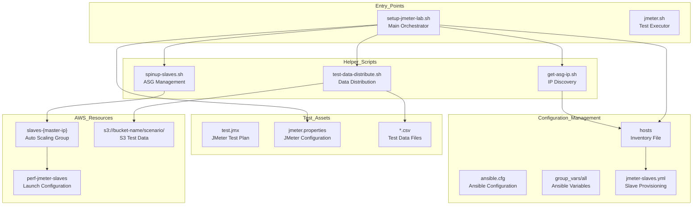
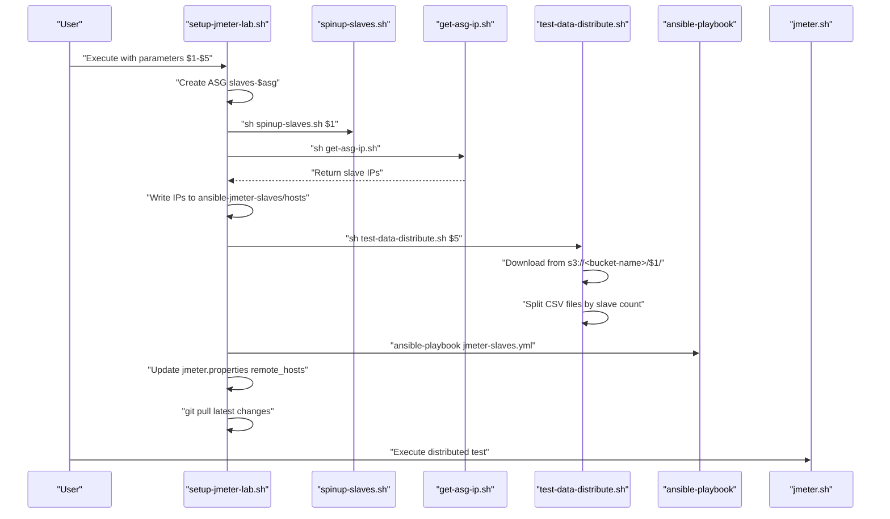
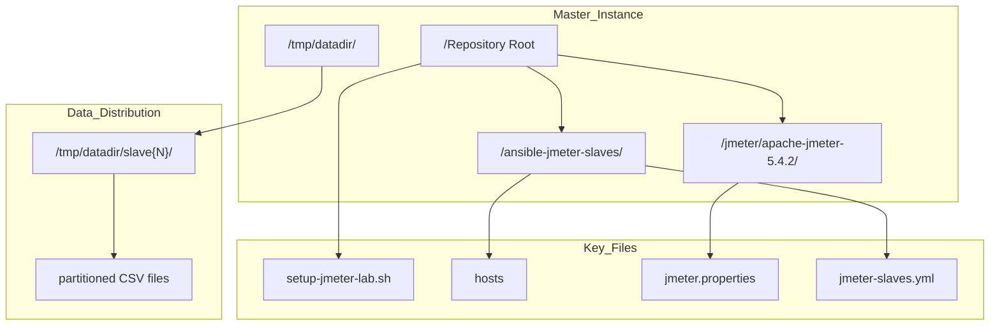

# Component Reference

Relevant source files

The following files were used as context for generating this wiki page:

- [setup-jmeter-lab.sh](setup-jmeter-lab.sh)
- [test-data-distribute.sh](test-data-distribute.sh)

This page provides a comprehensive reference for all scripts, configuration files, and system components in the automated distributed load testing system. It serves as a central index of the codebase's key elements and their relationships.

For detailed documentation of specific component categories, see:
- Main orchestration script: [Main Orchestration Script](#8.1)  
- Helper utilities: [Helper Scripts](#8.2)
- Configuration files: [Configuration Files Reference](#8.3)

## System Component Overview

The following diagram maps the natural language system components to their actual code entities and file locations:

**Sources:** [setup-jmeter-lab.sh:1-43](), [test-data-distribute.sh:1-27]()

## Script Execution Flow

This diagram shows the execution flow and dependencies between the main components:

**Sources:** [setup-jmeter-lab.sh:6-43](), [test-data-distribute.sh:6-26]()

## Component Categories

### Entry Point Scripts

| Script | Purpose | Parameters |
|--------|---------|------------|
| `setup-jmeter-lab.sh` | Primary orchestration script that provisions infrastructure and configures the distributed testing environment | `$1`: slave count, `$2`: git_user, `$3`: git_pass, `$4`: git_branch, `$5`: S3 scenario folder |
| `jmeter.sh` | Executes distributed JMeter tests using configured master-slave setup | Test plan and execution parameters |

### Helper Scripts

| Script | Function | Key Operations |
|--------|----------|----------------|
| `spinup-slaves.sh` | Manages Auto Scaling Group capacity to provision slave instances | Updates ASG min/max/desired counts |
| `get-asg-ip.sh` | Discovers IP addresses of provisioned slave instances | Queries AWS ASG for instance details |
| `test-data-distribute.sh` | Partitions test data across slave instances to prevent duplication | Downloads from S3, splits CSV files, distributes to slave-specific directories |

**Sources:** [setup-jmeter-lab.sh:19](), [setup-jmeter-lab.sh:26](), [test-data-distribute.sh:1-27]()

### Configuration Management Files

| File Path | Purpose | Key Settings |
|-----------|---------|--------------|
| `ansible-jmeter-slaves/ansible.cfg` | Ansible configuration for slave management | SSH settings, inventory location |
| `ansible-jmeter-slaves/group_vars/all` | Global variables for Ansible playbooks | Environment-specific settings |
| `ansible-jmeter-slaves/hosts` | Dynamic inventory of slave IP addresses | Populated by `get-asg-ip.sh` output |
| `ansible-jmeter-slaves/jmeter-slaves.yml` | Playbook for configuring JMeter slaves | Repository cloning, service startup |

### Test Assets

| Asset Type | Location | Configuration |
|------------|----------|---------------|
| JMeter Test Plans | `*.jmx` files | Test scenarios and load patterns |
| JMeter Properties | `jmeter/apache-jmeter-5.4.2/bin/jmeter.properties` | `remote_hosts` configuration updated by setup script |
| Test Data | S3 bucket paths, local `/tmp/datadir/` partitions | CSV files distributed per slave |

**Sources:** [setup-jmeter-lab.sh:32](), [setup-jmeter-lab.sh:40](), [test-data-distribute.sh:6-10]()

## File System Layout

The following diagram shows the key file system locations used during test execution:

**Sources:** [setup-jmeter-lab.sh:26](), [setup-jmeter-lab.sh:40](), [test-data-distribute.sh:6](), [test-data-distribute.sh:10]()

The system uses a combination of shell scripts for orchestration, Ansible for configuration management, and AWS services for infrastructure provisioning. Each component is designed to work together in a coordinated workflow that provisions, configures, and executes distributed load tests.

For implementation details of specific components, refer to the dedicated sections: [Main Orchestration Script](#8.1), [Helper Scripts](#8.2), and [Configuration Files Reference](#8.3).
