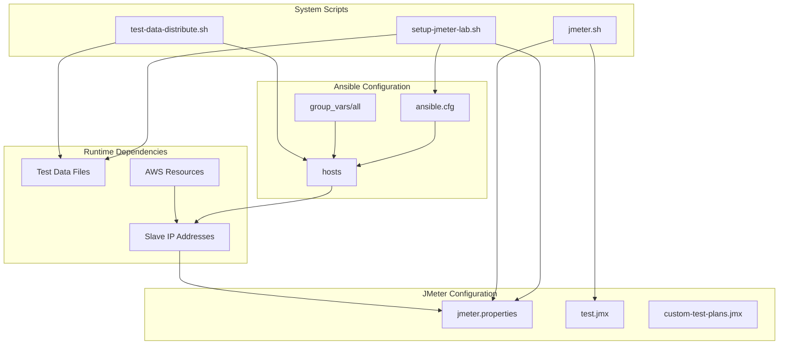
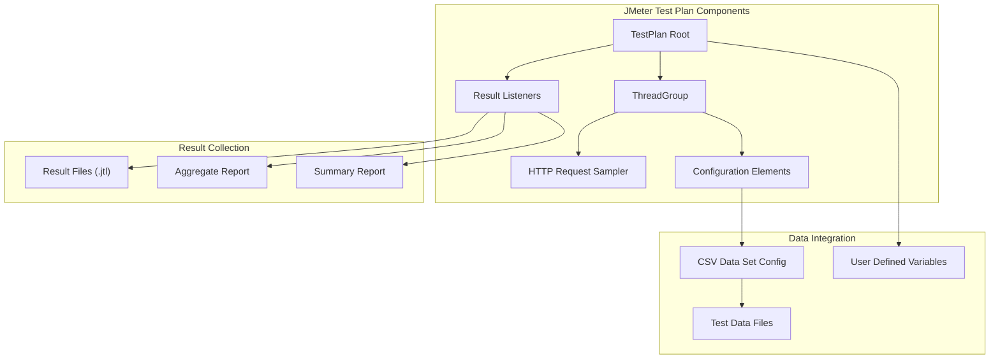
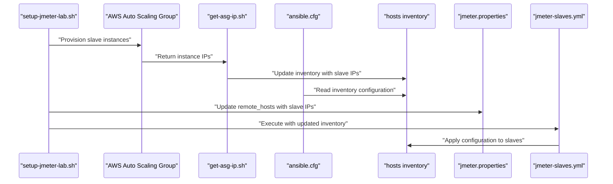
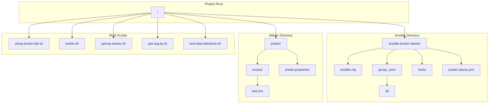

# Configuration Files Reference

<details>
<summary>Relevant source files</summary>

The following files were used as context for generating this wiki page:

- [ansible-jmeter-slaves/ansible.cfg](ansible-jmeter-slaves/ansible.cfg)
- [ansible-jmeter-slaves/group_vars/all](ansible-jmeter-slaves/group_vars/all)
- [jmeter/scripts/test.jmx](jmeter/scripts/test.jmx)

</details>


This document provides a comprehensive reference for all configuration files used in the automated distributed load testing system. These files control system behavior, define infrastructure parameters, manage Ansible automation, and configure JMeter test execution across the distributed environment.

For information about the scripts that use these configuration files, see [Main Orchestration Script](#8.1) and [Helper Scripts](#8.2). For details about how Ansible uses these configurations, see [Configuration Management](#5).

## Configuration File Hierarchy

The system uses several categories of configuration files that work together to orchestrate distributed load testing:

### Configuration File Structure



Sources: [ansible-jmeter-slaves/ansible.cfg:1-3](), [ansible-jmeter-slaves/group_vars/all:1-2](), [jmeter/scripts/test.jmx:1]()

## Ansible Configuration Files

### ansible.cfg

The main Ansible configuration file that defines basic behavior for slave instance management.

| Setting | Value | Purpose |
|---------|--------|---------|
| `inventory` | `hosts` | Points to the inventory file containing slave instance information |
| `host_key_checking` | `False` | Disables SSH host key verification for automated provisioning |

**File Location**: [ansible-jmeter-slaves/ansible.cfg:1-3]()

```ini
[defaults]
inventory = hosts
host_key_checking = False
```

This configuration enables Ansible to automatically connect to newly provisioned EC2 instances without manual SSH key verification, which is essential for automated slave provisioning.

### group_vars/all

Defines global Ansible variables applied to all managed hosts (JMeter slaves).

| Variable | Value | Purpose |
|----------|--------|---------|
| `ansible_python_interpreter` | `/usr/bin/python3` | Specifies Python 3 as the interpreter for Ansible modules |
| `ansible_user` | `ubuntu` | Sets the SSH user for connecting to Ubuntu-based EC2 instances |

**File Location**: [ansible-jmeter-slaves/group_vars/all:1-2]()

```yaml
ansible_python_interpreter: /usr/bin/python3
ansible_user : ubuntu
```

These variables ensure consistent connectivity across all slave instances using Ubuntu AMIs with Python 3.

### hosts Inventory File

The `hosts` file serves as the dynamic inventory for Ansible, populated automatically by the system scripts with slave instance IP addresses. This file is generated and updated by [get-asg-ip.sh]() during infrastructure provisioning.

**Format Structure**:
```ini
[slaves]
<slave-ip-1>
<slave-ip-2>
<slave-ip-n>
```

Sources: [ansible-jmeter-slaves/ansible.cfg:2](), [ansible-jmeter-slaves/group_vars/all:1-2]()

## JMeter Configuration Files

### jmeter.properties

The JMeter properties file configures the master-slave communication and testing parameters. This file is dynamically updated by [setup-jmeter-lab.sh]() to include the `remote_hosts` configuration.

**Key Configuration Parameters**:

| Property | Purpose | Dynamic Value |
|----------|---------|---------------|
| `remote_hosts` | Comma-separated list of slave IP addresses | Updated with discovered slave IPs |
| `server.rmi.ssl.disable` | Disables SSL for RMI communication | `true` (for simplified setup) |
| `server_port` | JMeter server port for slave communication | `1099` (default) |

**Example Configuration**:
```properties
remote_hosts=10.0.1.100,10.0.1.101,10.0.1.102
server.rmi.ssl.disable=true
server_port=1099
```

The `remote_hosts` property is the critical configuration that enables the JMeter master to discover and coordinate with all provisioned slave instances.

### Test Plan Files (.jmx)

JMeter test plans are XML-based configuration files that define the load testing scenarios, thread groups, and test logic.

**File Location**: [jmeter/scripts/test.jmx:1]()

**Test Plan Structure**:


Sources: [jmeter/scripts/test.jmx:1]()

## Configuration File Relationships

### Runtime Configuration Flow



### Configuration Dependencies

| Configuration File | Depends On | Updates | Used By |
|-------------------|------------|---------|---------|
| `ansible.cfg` | Static configuration | None | Ansible playbook execution |
| `group_vars/all` | Static configuration | None | All Ansible tasks |
| `hosts` | Slave IP discovery | `get-asg-ip.sh` | Ansible, test data distribution |
| `jmeter.properties` | Slave IP discovery | `setup-jmeter-lab.sh` | JMeter master execution |
| `test.jmx` | Manual creation/editing | User modifications | JMeter test execution |

## File System Layout



Sources: [ansible-jmeter-slaves/ansible.cfg:1-3](), [ansible-jmeter-slaves/group_vars/all:1-2](), [jmeter/scripts/test.jmx:1]()

## Configuration Best Practices

### Security Considerations

- **SSH Host Key Checking**: Disabled in `ansible.cfg` for automation, but consider enabling in production environments
- **User Permissions**: The `ubuntu` user in `group_vars/all` requires appropriate sudo permissions on slave instances
- **Network Security**: Ensure security groups properly restrict access to JMeter ports (1099, 4440-4445)

### Maintenance Guidelines

- **Dynamic Updates**: Never manually edit the `hosts` inventory file as it's automatically regenerated
- **Property Synchronization**: Ensure `jmeter.properties` remote_hosts matches the actual provisioned slave count
- **Test Plan Validation**: Validate `.jmx` files in JMeter GUI before using in distributed mode
- **Version Control**: Track test plan changes but exclude dynamic files like `hosts` and updated `jmeter.properties`

Sources: [ansible-jmeter-slaves/ansible.cfg:1-3](), [ansible-jmeter-slaves/group_vars/all:1-2]()
