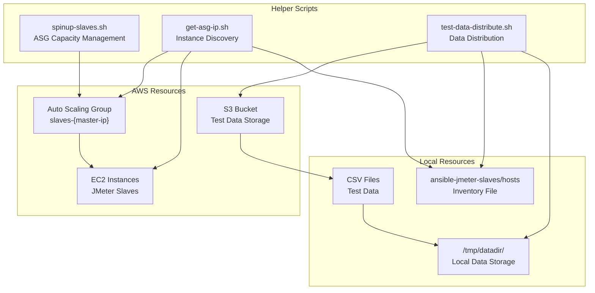
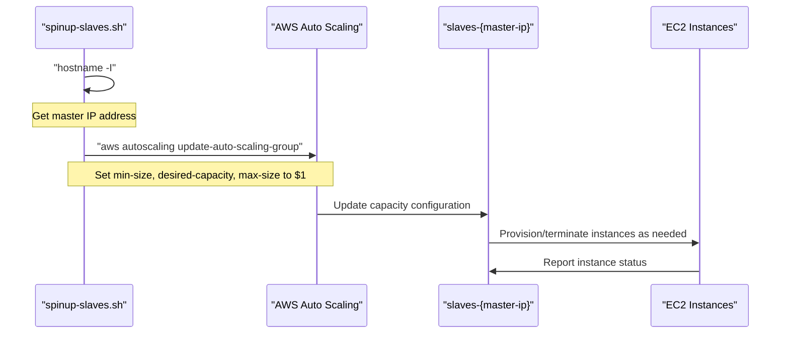
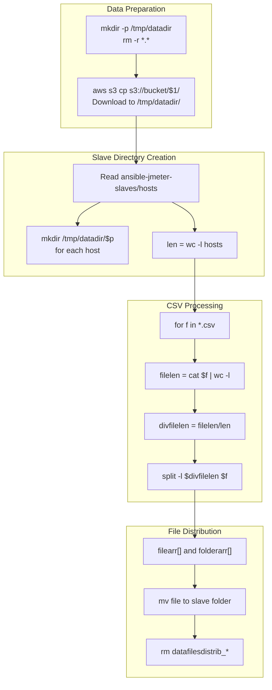

# Helper Scripts

<details>
<summary>Relevant source files</summary>

The following files were used as context for generating this wiki page:

- [get-asg-ip.sh](get-asg-ip.sh)
- [spinup-slaves.sh](spinup-slaves.sh)
- [test-data-distribute.sh](test-data-distribute.sh)

</details>


This page documents the utility scripts that support the automated distributed load testing system. These helper scripts handle specific operational tasks including AWS Auto Scaling Group management, instance discovery, and test data distribution across JMeter slaves.

The three main helper scripts are executed by the main orchestration script (for details on the primary orchestrator, see [Main Orchestration Script](#8.1)) and work together to provision infrastructure and prepare the distributed testing environment. For broader infrastructure concepts, see [Infrastructure Management](#4) and [Test Data Management](#6).

## Overview

The helper scripts form the operational foundation of the distributed load testing system, handling AWS resource management and data preparation tasks.

### Helper Script Architecture



*Sources: spinup-slaves.sh, get-asg-ip.sh, test-data-distribute.sh*

## Auto Scaling Group Management

### spinup-slaves.sh

The `spinup-slaves.sh` script manages the capacity of the AWS Auto Scaling Group that contains JMeter slave instances.

| Parameter | Description | Example |
|-----------|-------------|---------|
| `$1` | Number of desired slave instances | `5` |

#### Functionality

The script performs the following operations:

1. **Master IP Discovery**: Uses `hostname -I` to get the current master instance's IP address [spinup-slaves.sh:5]()
2. **ASG Identification**: Constructs the Auto Scaling Group name using pattern `slaves-$asg` [spinup-slaves.sh:7]()
3. **Capacity Update**: Updates the ASG with new min-size, desired-capacity, and max-size values [spinup-slaves.sh:7]()



*Sources: spinup-slaves.sh:3-7*

## Instance Discovery

### get-asg-ip.sh

The `get-asg-ip.sh` script discovers and outputs the private IP addresses of all instances in the Auto Scaling Group.

#### Functionality

The script executes a multi-step discovery process:

1. **Master IP Resolution**: Gets the master instance IP using `hostname -I` [get-asg-ip.sh:3]()
2. **Instance ID Extraction**: Queries the ASG to get all instance IDs [get-asg-ip.sh:5]()
3. **IP Address Resolution**: For each instance ID, retrieves the private IP address [get-asg-ip.sh:7]()

#### AWS CLI Command Chain

```mermaid
graph LR
    subgraph "Command Pipeline"
        ASG_CMD["aws autoscaling<br/>describe-auto-scaling-groups"]
        GREP1["grep -i instanceid"]
        AWK1["awk '{ print $2 }'"]
        CUT1["cut -d',' -f1"]
        SED1["sed -e 's/\"//g'"]
        
        EC2_CMD["aws ec2<br/>describe-instances"]
        GREP2["grep -i PrivateIpAddress"]
        AWK2["awk '{ print $2 }'"]
        HEAD["head -1"]
        CUT2["cut -d',' -f1"]
    end
    
    ASG_CMD --> GREP1
    GREP1 --> AWK1
    AWK1 --> CUT1
    CUT1 --> SED1
    SED1 --> EC2_CMD
    EC2_CMD --> GREP2
    GREP2 --> AWK2
    AWK2 --> HEAD
    HEAD --> CUT2
```

The script uses a shell loop to process each instance ID and extract clean private IP addresses [get-asg-ip.sh:5-8]().

*Sources: get-asg-ip.sh:3-8*

## Test Data Distribution

### test-data-distribute.sh

The `test-data-distribute.sh` script handles downloading test data from S3 and partitioning it evenly across JMeter slave instances to prevent data overlap during load testing.

#### Parameters

| Parameter | Description | Example |
|-----------|-------------|---------|
| `$1` | S3 folder path containing test data | `scenario-folder` |

#### Data Distribution Workflow



#### Implementation Details

**Directory Setup**: The script creates a clean working directory and downloads all files from the specified S3 path [test-data-distribute.sh:5-7]().

**Slave Enumeration**: Reads the Ansible hosts file to determine the number of slaves and creates corresponding directories [test-data-distribute.sh:10-11]().

**CSV Partitioning**: For each CSV file, the script:
- Calculates total line count [test-data-distribute.sh:17]()
- Determines lines per partition [test-data-distribute.sh:18]()  
- Uses `split` command to create equal-sized chunks [test-data-distribute.sh:19]()
- Maps split files to slave directories [test-data-distribute.sh:20-22]()

**Cleanup**: Removes temporary split files to maintain a clean workspace [test-data-distribute.sh:26]().

### Data Partitioning Logic

The partitioning ensures each slave receives a unique subset of test data:

| Metric | Calculation | Source |
|--------|-------------|--------|
| Total slaves | `wc -l ansible-jmeter-slaves/hosts` | Line 11 |
| Lines per file | `cat $f \| wc -l` | Line 17 |
| Lines per partition | `filelen/len` | Line 18 |
| Split command | `split -l $divfilelen $f datafilesdistrib_` | Line 19 |

*Sources: test-data-distribute.sh:5-26*

## Integration with Main Orchestrator

These helper scripts are invoked by the main orchestration script (`setup-jmeter-lab.sh`) in a coordinated sequence:

1. `spinup-slaves.sh` provisions the required number of slave instances
2. `get-asg-ip.sh` discovers the IP addresses of provisioned slaves
3. `test-data-distribute.sh` partitions and distributes test data across slaves

The output from `get-asg-ip.sh` is typically used to populate the Ansible inventory file, enabling configuration management of the slave instances (see [Inventory Management](#5.2) for details).

*Sources: spinup-slaves.sh, get-asg-ip.sh, test-data-distribute.sh*
