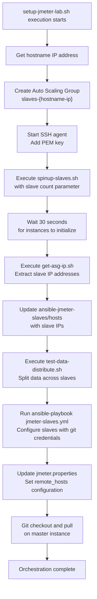
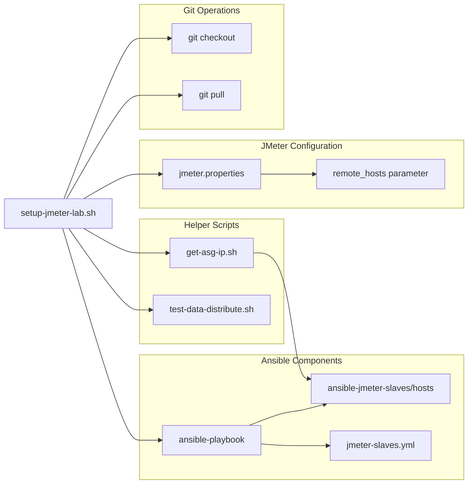

# Main Orchestration Script

<details>
<summary>Relevant source files</summary>

The following files were used as context for generating this wiki page:

- [setup-jmeter-lab.sh](setup-jmeter-lab.sh)

</details>


This document provides detailed documentation for `setup-jmeter-lab.sh`, the primary orchestration script that coordinates the entire distributed JMeter testing environment setup. This script serves as the central entry point for provisioning AWS infrastructure, configuring JMeter slaves, and preparing the distributed testing environment.

For information about the individual helper scripts called by this orchestrator, see [Helper Scripts](#8.2). For details about configuration management performed during orchestration, see [Configuration Management](#5).

## Purpose and Scope

The `setup-jmeter-lab.sh` script automates the complete workflow of setting up a distributed JMeter testing environment on AWS. It orchestrates infrastructure provisioning, configuration management, test data distribution, and JMeter cluster coordination in a single execution flow.

**Sources:** [setup-jmeter-lab.sh:1-43]()

## Script Parameters

The orchestration script accepts five positional parameters that control various aspects of the setup process:

| Parameter | Position | Purpose | Passed To |
|-----------|----------|---------|-----------|
| Slave Count | `$1` | Number of JMeter slave instances to provision | `spinup-slaves.sh` |
| Git Username | `$2` | GitHub username for repository access | Ansible playbook |
| Git Password | `$3` | GitHub password/token for authentication | Ansible playbook |
| Git Branch | `$4` | Repository branch to checkout and deploy | Ansible playbook, local git operations |
| Data Directory | `$5` | Test data directory for distribution | `test-data-distribute.sh` |

**Sources:** [setup-jmeter-lab.sh:19,29,32,43]()

## Orchestration Workflow

The script executes a carefully sequenced workflow that builds the distributed testing environment step by step:



**Sources:** [setup-jmeter-lab.sh:3-43]()

## Infrastructure Provisioning Phase

The script begins by establishing the core AWS infrastructure required for distributed testing:

### Auto Scaling Group Creation

The script creates an Auto Scaling Group with a dynamic name based on the master instance's IP address:

```bash
asg=$(hostname  -I)
aws autoscaling create-auto-scaling-group --auto-scaling-group-name slaves-$asg \
    --launch-configuration-name <value> --min-size 1 --max-size 1 \
    --vpc-zone-identifier "<value>"
```

This naming convention ensures unique ASG names per master instance, enabling multiple concurrent test environments.

**Sources:** [setup-jmeter-lab.sh:3,6,10]()

### SSH Connectivity Setup

The script configures SSH connectivity required for Ansible configuration management:

```bash
eval `ssh-agent -s`
ssh-add <key.pem>
```

This establishes the SSH agent and loads the private key necessary for Ansible to connect to provisioned slave instances.

**Sources:** [setup-jmeter-lab.sh:13,16]()

## Slave Instance Management

### Instance Provisioning

The script delegates slave instance provisioning to the `spinup-slaves.sh` helper script, passing the desired slave count:

```bash
sh spinup-slaves.sh $1
```

After provisioning, the script includes a 30-second wait period to allow instances to complete their initialization process before proceeding with configuration.

**Sources:** [setup-jmeter-lab.sh:19,21]()

### IP Address Discovery and Inventory Update

The script dynamically discovers slave instance IP addresses and updates the Ansible inventory:

```bash
sh get-asg-ip.sh | awk -F '"' '{print $2}' > ansible-jmeter-slaves/hosts
```

This pipeline extracts IP addresses from the ASG metadata and populates the Ansible hosts file, enabling subsequent configuration management operations.

**Sources:** [setup-jmeter-lab.sh:26]()

## Configuration Management Integration



**Sources:** [setup-jmeter-lab.sh:26,29,32,36-40,43]()

### Test Data Distribution

The script orchestrates test data partitioning across slave instances to prevent data duplication during load testing:

```bash
sh test-data-distribute.sh $5
```

This ensures each slave receives a unique subset of the test data, enabling proper distributed load generation without overlap.

**Sources:** [setup-jmeter-lab.sh:29]()

### Ansible Playbook Execution

The script executes the Ansible playbook that configures JMeter slaves with repository access and service startup:

```bash
cd ansible-jmeter-slaves && ansible-playbook jmeter-slaves.yml -u ubuntu \
    -e "git_user=$2" -e "git_pass=$3" -e "git_branch=$4"
```

This command passes Git credentials and branch information as Ansible extra variables, enabling slaves to clone the test repository.

**Sources:** [setup-jmeter-lab.sh:32]()

## JMeter Master Configuration

### Remote Hosts Configuration

The script dynamically updates the JMeter master's `remote_hosts` property with the discovered slave IP addresses:

```bash
OUT=$(sh $dir/get-asg-ip.sh | awk -F '"' '{print $2}' | awk '{ printf("%s,", $0) }' | rev | cut -c2- | rev)
sed -i "s/remote_hosts=.*/remote_hosts=$OUT/g" $dir/jmeter/apache-jmeter-5.4.2/bin/jmeter.properties
```

This pipeline creates a comma-separated list of slave IPs and updates the JMeter properties file, enabling the master to coordinate with all provisioned slaves.

**Sources:** [setup-jmeter-lab.sh:36,40]()

### Master Repository Synchronization

The script ensures the master instance has the latest test scripts and configuration:

```bash
cd $dir && git checkout $4 && git pull https://$2:$3@github.com/automated-distributed-load-test.git
```

This operation synchronizes the master with the specified Git branch using the provided credentials.

**Sources:** [setup-jmeter-lab.sh:43]()

## Configuration Requirements

The script requires several configuration placeholders to be updated before execution:

| Configuration Item | Location | Required Value |
|-------------------|----------|----------------|
| Launch Configuration Name | Line 10 | AWS Launch Configuration for slave instances |
| VPC Zone Identifier | Line 10 | Subnet IDs for slave instance placement |
| PEM Key File | Line 16 | Private key file for SSH authentication |
| GitHub Repository URL | Line 43 | Complete repository URL for test scripts |

**Sources:** [setup-jmeter-lab.sh:10,16,43]()

## Dependencies and Integration Points

The orchestration script integrates with multiple system components and external dependencies:

### Required Helper Scripts
- `spinup-slaves.sh` - Auto Scaling Group instance management
- `get-asg-ip.sh` - Instance IP address discovery
- `test-data-distribute.sh` - Test data partitioning

### Required Directory Structure
- `ansible-jmeter-slaves/` - Ansible configuration directory
- `jmeter/apache-jmeter-5.4.2/bin/` - JMeter installation directory

### External Dependencies
- AWS CLI configured with appropriate permissions
- Git repository with test scripts and configurations
- SSH key pair for instance access
- Ansible installation for configuration management

**Sources:** [setup-jmeter-lab.sh:19,26,29,32,40]()
