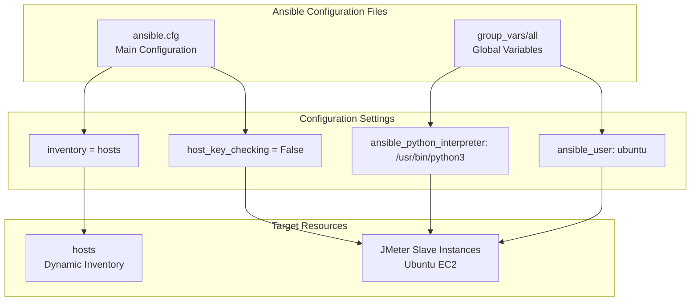
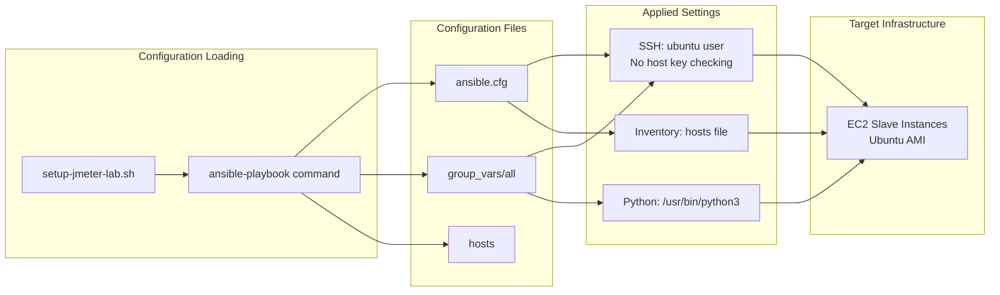

# Ansible Configuration

Relevant source files

The following files were used as context for generating this wiki page:

- [ansible-jmeter-slaves/ansible.cfg](ansible-jmeter-slaves/ansible.cfg)
- [ansible-jmeter-slaves/group_vars/all](ansible-jmeter-slaves/group_vars/all)

## Purpose and Scope

This page documents the Ansible configuration files used to manage JMeter slave instances in the distributed load testing system. The configuration includes the main Ansible settings and global variables that control how Ansible connects to and manages the slave instances.

For information about the Ansible inventory management, see [Inventory Management](#5.2). For details about the actual JMeter slave provisioning playbook, see [JMeter Slave Provisioning](#5.3).

## Configuration Overview

The Ansible configuration for this system consists of two primary configuration files located in the `ansible-jmeter-slaves/` directory:

| File | Purpose |
|------|---------|
| `ansible.cfg` | Main Ansible configuration settings |
| `group_vars/all` | Global variables applied to all managed hosts |

These configurations are designed to work with Ubuntu-based EC2 instances and handle the specific requirements of managing ephemeral JMeter slave instances in AWS.

## Main Ansible Configuration

The primary Ansible configuration is defined in [ansible-jmeter-slaves/ansible.cfg:1-3](). This file contains essential settings that control Ansible's behavior when managing the JMeter slaves.

### Inventory Configuration

The configuration specifies the inventory file location:
- `inventory = hosts` - Points to the dynamically generated hosts file that contains slave instance IP addresses

### SSH Connection Settings

The configuration includes security and connection settings:
- `host_key_checking = False` - Disables SSH host key verification, necessary for connecting to dynamically provisioned EC2 instances

This setting is crucial because the slave instances are ephemeral and their SSH host keys are not known in advance.

**Sources:** [ansible-jmeter-slaves/ansible.cfg:1-3]()

## Global Variables Configuration

The global variables are defined in [ansible-jmeter-slaves/group_vars/all:1-2]() and apply to all managed hosts in the inventory.

### Python Interpreter Configuration

The configuration specifies the Python interpreter to use on target hosts:
- `ansible_python_interpreter: /usr/bin/python3` - Ensures Ansible uses Python 3 on the slave instances

### User Configuration

The configuration defines the SSH user for connections:
- `ansible_user: ubuntu` - Specifies the default user for connecting to Ubuntu-based EC2 instances

**Sources:** [ansible-jmeter-slaves/group_vars/all:1-2]()

## Ansible Configuration Architecture

**Sources:** [ansible-jmeter-slaves/ansible.cfg:1-3](), [ansible-jmeter-slaves/group_vars/all:1-2]()

## Configuration Integration Flow

**Sources:** [ansible-jmeter-slaves/ansible.cfg:1-3](), [ansible-jmeter-slaves/group_vars/all:1-2]()

## Configuration Usage Context

These Ansible configuration files are automatically utilized when the main orchestration script executes Ansible commands to provision JMeter slaves. The configuration ensures that:

1. **Inventory Management**: Ansible knows to read the dynamically generated `hosts` file
2. **Connection Security**: SSH connections bypass host key checking for ephemeral instances
3. **Runtime Environment**: Python 3 is used on target instances for Ansible modules
4. **User Authentication**: Connections use the standard `ubuntu` user for Ubuntu AMI instances

The configuration is designed to work seamlessly with the AWS Auto Scaling Group provisioned instances and requires no manual intervention during the automated setup process.

**Sources:** [ansible-jmeter-slaves/ansible.cfg:1-3](), [ansible-jmeter-slaves/group_vars/all:1-2]()
