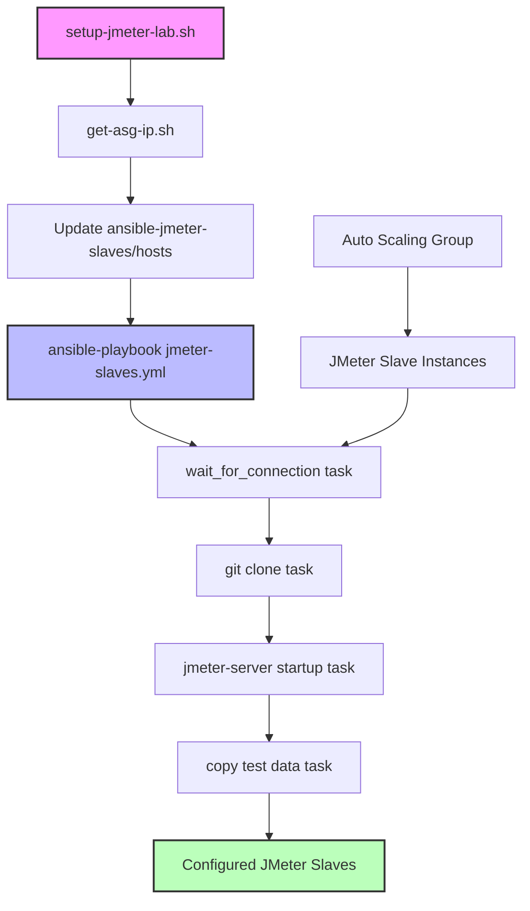
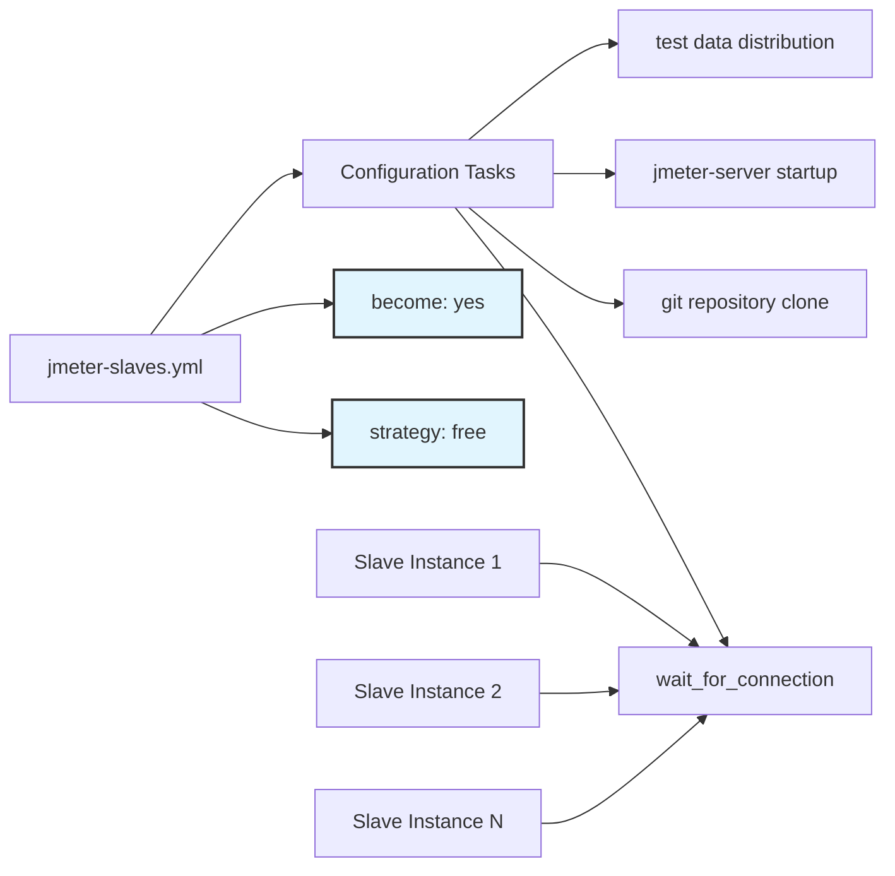
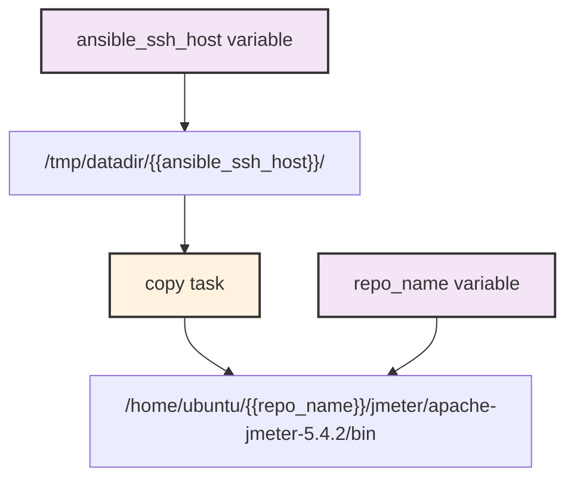

# Configuration Management

Relevant source files

The following files were used as context for generating this wiki page:

- [ansible-jmeter-slaves/ansible.cfg](ansible-jmeter-slaves/ansible.cfg)
- [ansible-jmeter-slaves/jmeter-slaves.yml](ansible-jmeter-slaves/jmeter-slaves.yml)

## Purpose and Scope

This section covers the Ansible-based configuration management system used to provision and configure JMeter slave instances after they are launched by the Auto Scaling Group. The configuration management layer handles repository synchronization, JMeter server startup, and test data distribution across the distributed testing cluster.

For details on AWS infrastructure provisioning that precedes configuration management, see [Infrastructure Management](#4). For specific Ansible configuration details, see [Ansible Configuration](#5.1), [Inventory Management](#5.2), and [JMeter Slave Provisioning](#5.3).

## Configuration Management Overview

The system uses Ansible to configure JMeter slave instances in a distributed testing environment. After AWS Auto Scaling Groups provision EC2 instances, the configuration management layer ensures each slave is properly configured with the necessary software, repositories, and test data to participate in distributed load testing.

The configuration management approach follows a declarative model where the desired state of each JMeter slave is defined in Ansible playbooks and applied consistently across all instances in the cluster.

## Configuration Management Workflow

Sources: [ansible-jmeter-slaves/jmeter-slaves.yml:1-28]()

## Core Configuration Components

### Ansible Control Configuration

The system uses a minimal Ansible configuration to manage the JMeter slave fleet. The configuration disables host key checking to streamline automated provisioning and uses a dynamic inventory file.

| Component | Purpose | Location |
|-----------|---------|----------|
| `ansible.cfg` | Base Ansible configuration | [ansible-jmeter-slaves/ansible.cfg:1-3]() |
| `hosts` inventory | Dynamic list of slave IP addresses | Referenced in [ansible-jmeter-slaves/ansible.cfg:2]() |
| `jmeter-slaves.yml` | Main configuration playbook | [ansible-jmeter-slaves/jmeter-slaves.yml:1-28]() |

### Playbook Execution Strategy

The `jmeter-slaves.yml` playbook uses the `free` strategy to maximize parallelization when configuring multiple slave instances simultaneously. This reduces the overall configuration time for large slave clusters.

Sources: [ansible-jmeter-slaves/jmeter-slaves.yml:3](), [ansible-jmeter-slaves/jmeter-slaves.yml:2]()

## Configuration Tasks and Variables

### Repository Synchronization

The configuration management system clones the latest version of the test repository to each slave instance using parameterized Git credentials and branch specifications.

| Variable | Purpose |
|----------|---------|
| `git_user` | GitHub username for repository access |
| `git_pass` | GitHub access token or password |
| `git_branch` | Target branch to clone |
| `repo_name` | Repository name (defaults to `automated-distributed-load-test`) |

### JMeter Server Process Management

Each slave instance runs a `jmeter-server` process that listens for commands from the JMeter master. The configuration ensures this process starts automatically after repository synchronization.

### Test Data Distribution

The configuration management layer handles copying partitioned test data from the master instance to each slave's working directory. This ensures each slave receives its designated portion of the test dataset.

Sources: [ansible-jmeter-slaves/jmeter-slaves.yml:24-28](), [ansible-jmeter-slaves/jmeter-slaves.yml:6]()

## Integration with System Components

The configuration management layer operates as a bridge between infrastructure provisioning and test execution:

- **Input**: Receives slave IP addresses from AWS Auto Scaling Group discovery
- **Processing**: Applies consistent configuration across all slave instances  
- **Output**: Provides ready-to-use JMeter slaves for distributed testing

The configuration process is triggered by the main orchestration script after infrastructure provisioning completes and before test execution begins.

Sources: [ansible-jmeter-slaves/ansible.cfg:1-3](), [ansible-jmeter-slaves/jmeter-slaves.yml:1-28]()
