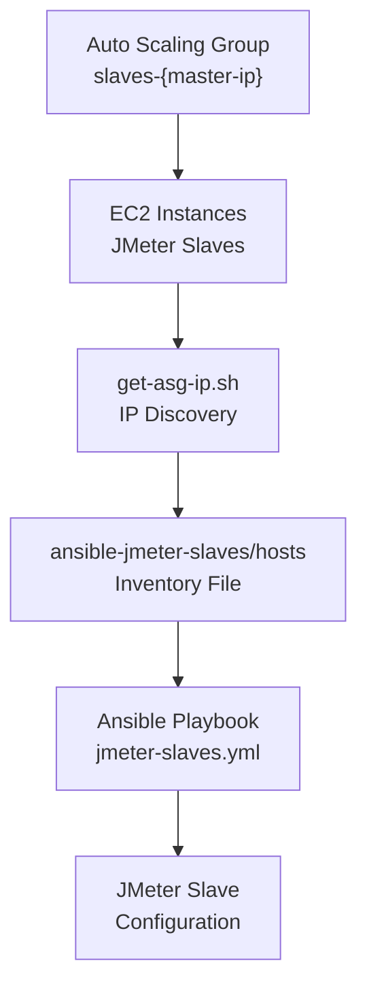
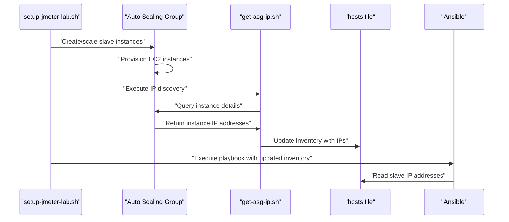
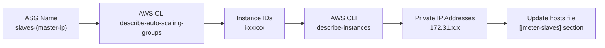
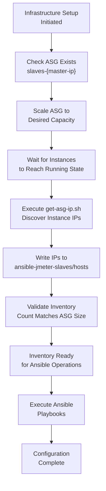

# Inventory Management

Relevant source files

The following files were used as context for generating this wiki page:

- [ansible-jmeter-slaves/hosts](ansible-jmeter-slaves/hosts)

## Purpose and Scope

This document covers the Ansible inventory management system used to track and manage JMeter slave instances in the distributed load testing environment. The inventory system maintains a dynamic list of slave instance IP addresses that are automatically discovered from AWS Auto Scaling Groups and used by Ansible for configuration management.

For details about AWS Auto Scaling Group provisioning, see [Auto Scaling Group Management](#4.1). For the IP address discovery process, see [Instance Discovery](#4.2). For broader Ansible configuration details, see [Ansible Configuration](#5.1). For how the inventory is used to provision slaves, see [JMeter Slave Provisioning](#5.3).

## Inventory File Structure

The Ansible inventory is maintained in the `hosts` file located in the `ansible-jmeter-slaves` directory. This file serves as the central registry of all active JMeter slave instances that Ansible will manage.

The inventory file follows the standard Ansible inventory format and contains IP addresses of slave instances grouped under a `[jmeter-slaves]` group header.

Sources: [ansible-jmeter-slaves/hosts:1]()

## Dynamic Inventory Population Process

The inventory management system follows a dynamic approach where the `hosts` file is automatically populated with current slave instance information rather than being manually maintained.

The process involves:

1. **Instance Provisioning**: The Auto Scaling Group creates new slave instances
2. **IP Discovery**: The `get-asg-ip.sh` script queries AWS for instance IP addresses
3. **Inventory Update**: The discovered IPs are written to the `hosts` file
4. **Ansible Execution**: Playbooks use the updated inventory for configuration

Sources: [ansible-jmeter-slaves/hosts:1]()

## Inventory Format and Structure

The inventory file maintains a simple structure with slave instances organized under the `[jmeter-slaves]` group:

| Component | Format | Purpose |
|-----------|--------|---------|
| Group Header | `[jmeter-slaves]` | Defines the Ansible group for slave instances |
| IP Entries | `172.31.x.x` | Individual slave instance IP addresses |
| Comments | `# Generated dynamically` | Metadata about inventory generation |

The inventory structure enables Ansible to:
- Target all slaves simultaneously using the `jmeter-slaves` group
- Apply consistent configuration across all instances
- Scale operations based on the current number of active slaves

## Integration with AWS Auto Scaling Groups

The inventory management system is tightly integrated with AWS Auto Scaling Groups to ensure the inventory always reflects the current state of the infrastructure.

Key integration points:

- **ASG Naming Convention**: Auto Scaling Groups follow the pattern `slaves-{master-ip}` for identification
- **Instance Filtering**: Only instances in the `running` state are included in the inventory
- **IP Address Selection**: Private IP addresses are used for internal communication within the VPC
- **Automatic Synchronization**: Inventory updates occur each time the infrastructure is modified

## Inventory Management Workflow

The complete inventory management workflow ensures that the Ansible inventory stays synchronized with the actual AWS infrastructure state:

The workflow includes validation steps to ensure:
- The number of inventory entries matches the Auto Scaling Group desired capacity
- All IP addresses are reachable and valid
- The inventory format is correct for Ansible consumption

This dynamic approach eliminates manual inventory management and ensures the configuration system can adapt to infrastructure changes automatically.

Sources: [ansible-jmeter-slaves/hosts:1]()
