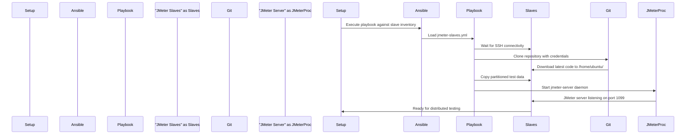
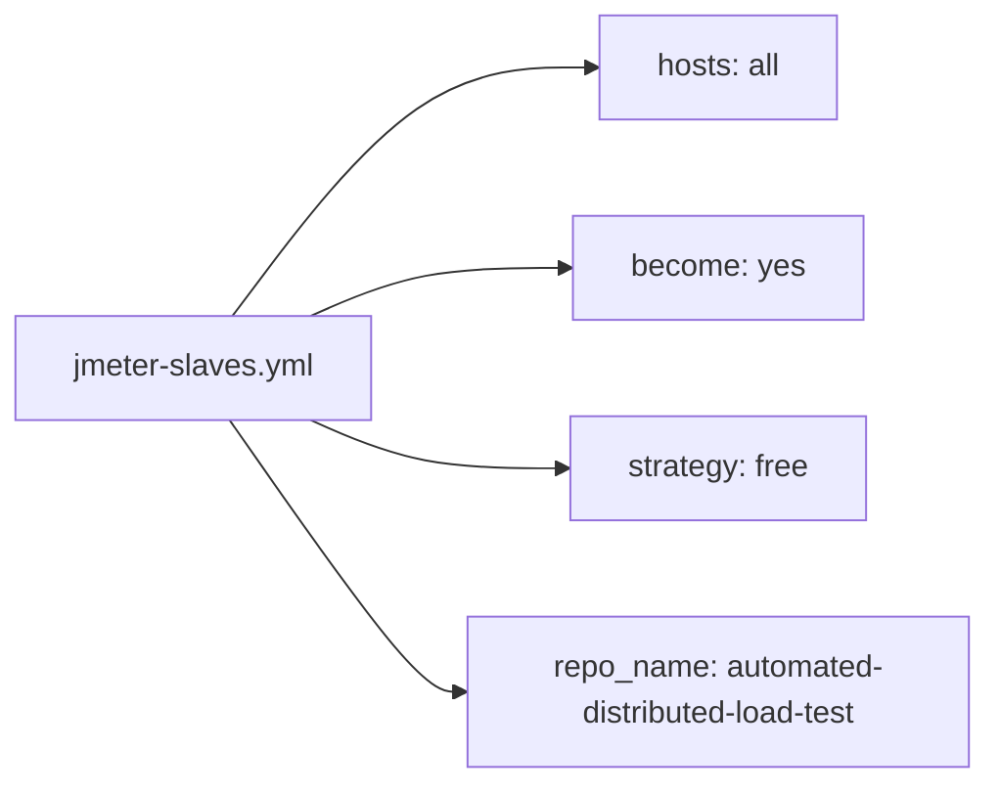
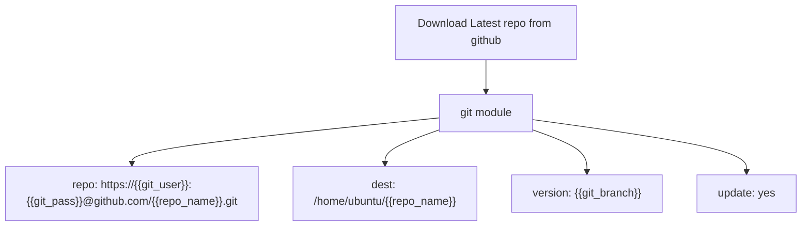
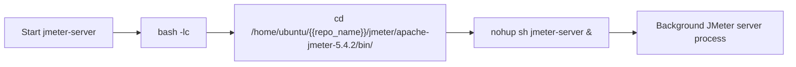
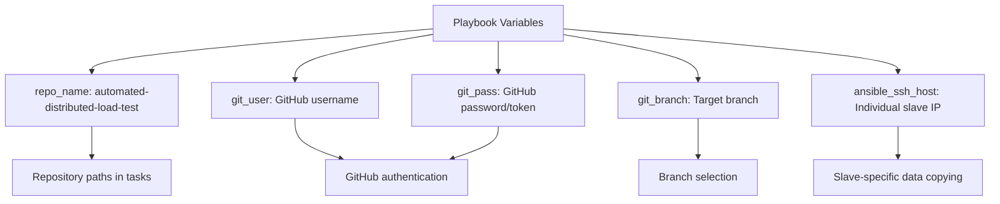

# JMeter Slave Provisioning

Relevant source files

The following files were used as context for generating this wiki page:

- [ansible-jmeter-slaves/jmeter-slaves.yml](ansible-jmeter-slaves/jmeter-slaves.yml)

This document covers the Ansible playbook responsible for configuring and provisioning JMeter slave instances in the distributed load testing system. This page details how slave instances are prepared with the necessary software, repository code, and test data to participate in distributed JMeter tests.

For information about Ansible configuration files and settings, see [Ansible Configuration](#5.1). For details about how slave instances are discovered and added to the inventory, see [Inventory Management](#5.2).

## Purpose and Scope

The JMeter slave provisioning process is handled by the `jmeter-slaves.yml` Ansible playbook, which transforms freshly launched EC2 instances into fully configured JMeter slave nodes. This playbook ensures that each slave instance has the correct repository code, running JMeter server processes, and appropriate test data partitions for distributed testing.

## Provisioning Workflow

The slave provisioning process follows a sequential workflow that prepares instances for load testing participation:

Sources: [ansible-jmeter-slaves/jmeter-slaves.yml:1-28]()

## Playbook Structure and Tasks

The `jmeter-slaves.yml` playbook contains four primary tasks that execute in sequence across all slave instances:

### Host Configuration and Strategy

The playbook targets all hosts in the Ansible inventory and uses elevated privileges with the `free` strategy for parallel execution:

Sources: [ansible-jmeter-slaves/jmeter-slaves.yml:1-7]()

### SSH Connectivity Verification

The first task ensures that all slave instances are accessible over SSH before proceeding with configuration:

| Task Property | Value |
|---------------|-------|
| Task Name | Wait for slaves to become reachable over ssh |
| Module | `wait_for_connection` |
| Timeout | 900 seconds (15 minutes) |
| Purpose | Prevents subsequent tasks from failing due to unavailable instances |

Sources: [ansible-jmeter-slaves/jmeter-slaves.yml:9-11]()

### Repository Synchronization

The playbook clones the latest repository code to each slave instance using Git credentials:

| Parameter | Variable | Purpose |
|-----------|----------|---------|
| Repository URL | `{{git_user}}:{{git_pass}}` | Authenticated GitHub access |
| Destination | `/home/ubuntu/{{repo_name}}` | Standard installation path |
| Branch | `{{git_branch}}` | Configurable branch selection |
| Update Mode | `yes` | Ensures latest code is pulled |

Sources: [ansible-jmeter-slaves/jmeter-slaves.yml:13-18]()

### JMeter Server Process Startup

The playbook starts the JMeter server daemon on each slave instance using a background process:

The command execution path: `/home/ubuntu/{{repo_name}}/jmeter/apache-jmeter-5.4.2/bin/jmeter-server`

Sources: [ansible-jmeter-slaves/jmeter-slaves.yml:20-22]()

### Test Data Distribution

The final task copies slave-specific test data partitions to the JMeter installation directory:

| Copy Operation | Source Path | Destination Path |
|----------------|-------------|------------------|
| Test data files | `/tmp/datadir/{{ansible_ssh_host}}/` | `/home/ubuntu/{{repo_name}}/jmeter/apache-jmeter-5.4.2/bin` |

The `{{ansible_ssh_host}}` variable ensures each slave receives its designated data partition, preventing data duplication across the distributed test environment.

Sources: [ansible-jmeter-slaves/jmeter-slaves.yml:24-28]()

## Variable Dependencies

The playbook relies on several external variables that must be defined in the Ansible execution context:

Sources: [ansible-jmeter-slaves/jmeter-slaves.yml:6](), [ansible-jmeter-slaves/jmeter-slaves.yml:15](), [ansible-jmeter-slaves/jmeter-slaves.yml:17](), [ansible-jmeter-slaves/jmeter-slaves.yml:27]()

## Integration Points

The playbook integrates with other system components through:

- **Inventory Management**: Executed against dynamically generated host inventory from [Inventory Management](#5.2)
- **Test Data Management**: Receives pre-partitioned data from the test data distribution process covered in [Test Data Management](#6)
- **Main Orchestration**: Invoked by `setup-jmeter-lab.sh` as part of the overall provisioning workflow documented in [Main Orchestration Script](#8.1)

The provisioned slaves become available for distributed testing once all tasks complete successfully, with JMeter server processes listening on the default port 1099 for master coordination.
