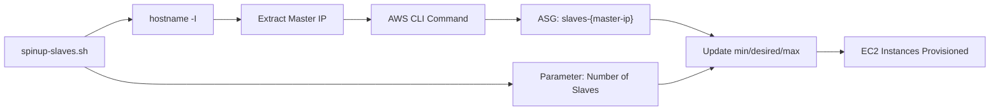
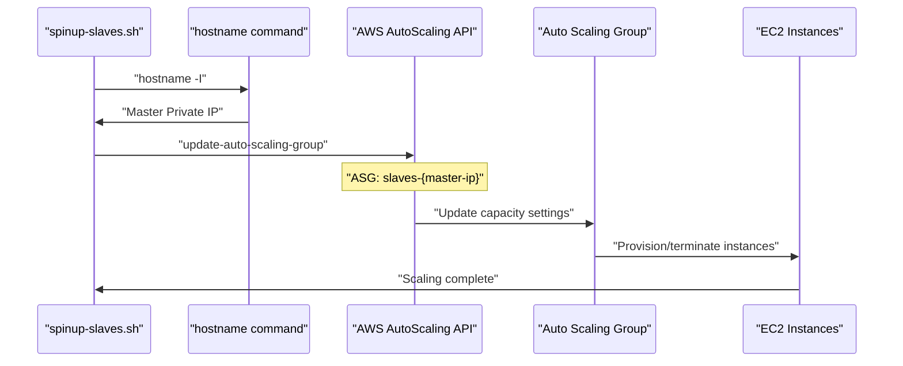

# Auto Scaling Group Management

Relevant source files

The following files were used as context for generating this wiki page:

- [spinup-slaves.sh](spinup-slaves.sh)

## Purpose and Scope

This document covers how the automated distributed load testing system manages AWS Auto Scaling Groups (ASGs) to provision and scale JMeter slave instances. The system uses ASGs to dynamically create the required number of EC2 instances that serve as JMeter slaves for distributed load testing.

For information about discovering IP addresses of provisioned instances, see [Instance Discovery](#4.2). For details about configuring the provisioned instances, see [Configuration Management](#5).

## Auto Scaling Group Naming Convention

The system uses a specific naming pattern for Auto Scaling Groups based on the master instance's IP address. This ensures isolation between different test environments and allows multiple masters to operate independently.

### ASG Name Pattern: `slaves-{master-ip}`

The Auto Scaling Group name follows the pattern `slaves-{master-ip}` where `{master-ip}` is the private IP address of the master instance. This naming convention serves several purposes:

- **Environment Isolation**: Each master instance manages its own dedicated set of slaves
- **Resource Identification**: Easy identification of which slaves belong to which master
- **Cleanup Operations**: Simplified resource cleanup by master IP association

Sources: [spinup-slaves.sh:5-7]()

## Scaling Operations

### Dynamic Slave Provisioning

The system provides dynamic scaling capabilities through the `spinup-slaves.sh` script, which adjusts the number of JMeter slave instances based on testing requirements.

#### Scaling Mechanism

The scaling operation sets three ASG parameters to the same value:
- `min-size`: Minimum number of instances
- `desired-capacity`: Target number of instances  
- `max-size`: Maximum number of instances

This configuration ensures immediate scaling to the exact number of required slaves without auto-scaling fluctuations during test execution.

**ASG Scaling Workflow**

Sources: [spinup-slaves.sh:1-7]()

### Implementation Details

The scaling implementation uses the AWS CLI `autoscaling update-auto-scaling-group` command with the following characteristics:

| Parameter | Value | Purpose |
|-----------|-------|---------|
| `auto-scaling-group-name` | `slaves-{master-ip}` | Target ASG identification |
| `min-size` | `$1` (script parameter) | Minimum instance count |
| `desired-capacity` | `$1` (script parameter) | Target instance count |
| `max-size` | `$1` (script parameter) | Maximum instance count |

The uniform setting of all three parameters prevents AWS auto-scaling from making automatic adjustments during test execution, ensuring consistent slave count throughout the testing process.

Sources: [spinup-slaves.sh:7]()

## Integration with System Workflow

### Master IP Discovery

The system determines the master instance IP using the `hostname -I` command, which retrieves the private IP address of the current instance. This IP is then used to construct the ASG name.

**Auto Scaling Group Management Flow**

Sources: [spinup-slaves.sh:5-7]()

### Launch Configuration Dependencies

The Auto Scaling Group relies on a pre-configured Launch Configuration named `perf-jmeter-slaves` (referenced in the overall system architecture). This Launch Configuration defines:

- AMI with pre-installed JMeter and dependencies
- Instance type and security group settings
- User data scripts for initial instance setup

The ASG management script focuses solely on capacity adjustment, while the Launch Configuration handles instance configuration templates.

## Operational Characteristics

### Scaling Behavior

The system implements **exact scaling** rather than gradual scaling:

- **Immediate Response**: All three capacity parameters are set to the same value
- **No Auto-Scaling**: Prevents AWS from making automatic adjustments
- **Deterministic Sizing**: Ensures exact number of slaves for test reproducibility

### Error Handling

The script provides minimal error handling, relying on AWS CLI return codes and built-in error reporting. Failed scaling operations will be reported through standard AWS CLI error messages.

Sources: [spinup-slaves.sh:1-7]()
