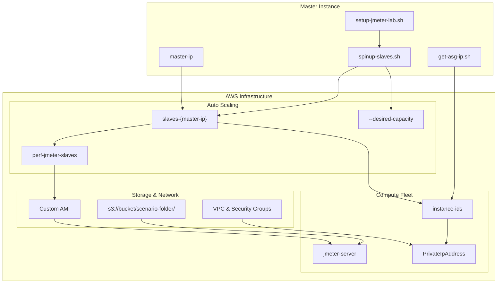
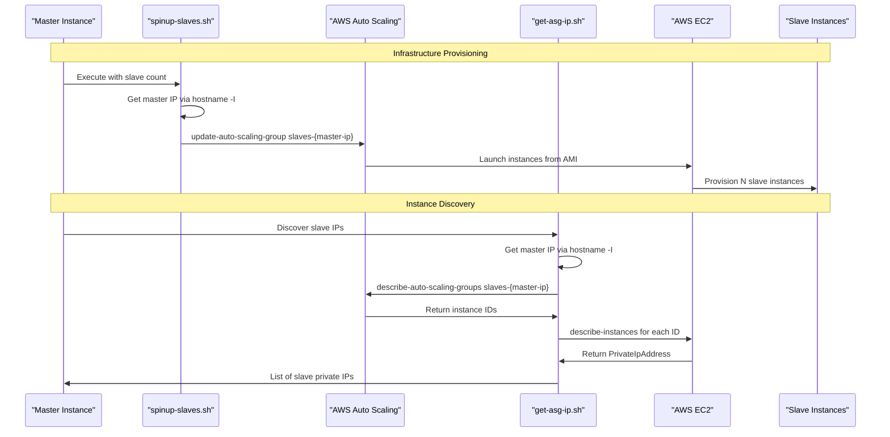
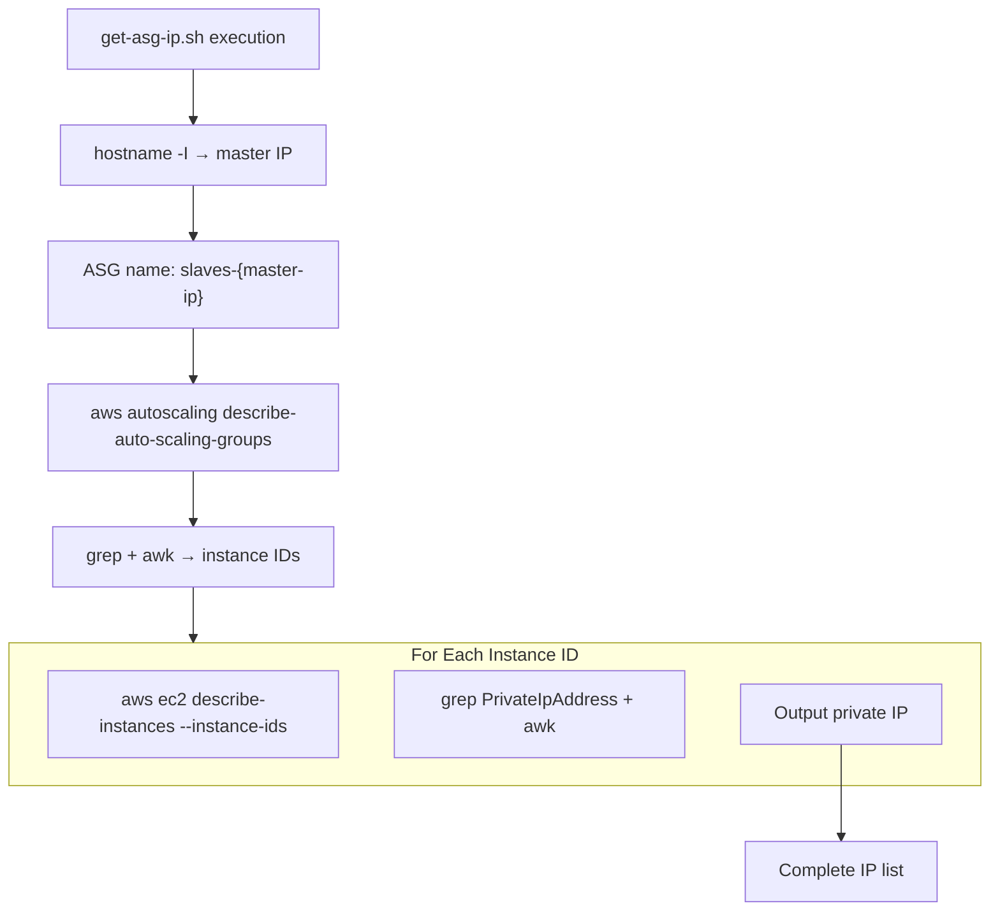

# Infrastructure Management

Relevant source files

The following files were used as context for generating this wiki page:

- [get-asg-ip.sh](get-asg-ip.sh)
- [spinup-slaves.sh](spinup-slaves.sh)

## Purpose and Scope

This document covers the AWS infrastructure components and management strategies used in the automated distributed load testing system. It provides an overview of how EC2 instances, Auto Scaling Groups, and supporting AWS resources are provisioned, configured, and managed throughout the testing lifecycle.

For detailed information about Auto Scaling Group operations, see [Auto Scaling Group Management](#4.1). For instance IP discovery mechanisms, see [Instance Discovery](#4.2). For Ansible-based configuration of provisioned instances, see [Configuration Management](#5).

## Infrastructure Overview

The system uses a master-slave architecture where a single master EC2 instance orchestrates multiple slave instances that are dynamically provisioned using AWS Auto Scaling Groups. The infrastructure is designed to be ephemeral and scalable, allowing for cost-effective load testing at various scales.

### Core Infrastructure Components

| Component | Purpose | Management Method |
|-----------|---------|-------------------|
| Master EC2 Instance | JMeter master, orchestration, result aggregation | Manual launch, persistent during test |
| Slave EC2 Instances | JMeter slave nodes, load generation | Auto Scaling Group, ephemeral |
| Auto Scaling Group | Dynamic slave provisioning and scaling | Programmatic via AWS CLI |
| Custom AMI | Pre-configured slave environment | Referenced in Launch Configuration |
| S3 Storage | Test data distribution and artifact storage | Accessed via AWS CLI |
| VPC/Security Groups | Network isolation and access control | Pre-configured, referenced |

**Infrastructure Component Architecture**

Sources: [spinup-slaves.sh:1-8](), [get-asg-ip.sh:1-8]()

## Auto Scaling Group Architecture

The system uses a naming convention where each master instance creates its own Auto Scaling Group using the master's IP address as a unique identifier. This allows multiple concurrent testing environments without resource conflicts.

**Auto Scaling Group Lifecycle**

Sources: [spinup-slaves.sh:3-7](), [get-asg-ip.sh:3-8]()

## Instance Management Operations

### Scaling Operations

The `spinup-slaves.sh` script provides dynamic scaling functionality by updating the Auto Scaling Group's capacity parameters:

- **Min Size**: Set to target slave count
- **Desired Capacity**: Set to target slave count  
- **Max Size**: Set to target slave count

This ensures the ASG maintains exactly the specified number of slave instances.

### IP Address Discovery

The `get-asg-ip.sh` script implements a two-stage discovery process:

1. **ASG Query**: Uses the master's IP to construct the ASG name `slaves-{master-ip}` and retrieves all instance IDs
2. **Instance Query**: For each instance ID, queries EC2 to get the private IP address

**IP Discovery Flow**

Sources: [get-asg-ip.sh:3-8]()

## Resource Naming and Identification

The system uses consistent naming conventions to ensure proper resource isolation and identification:

| Resource Type | Naming Pattern | Example |
|---------------|----------------|---------|
| Auto Scaling Group | `slaves-{master-ip}` | `slaves-172.31.45.123` |
| Launch Configuration | `perf-jmeter-slaves` | Static name |
| Instance Tags | Inherited from ASG | Auto-applied |

The master IP-based naming ensures that multiple testing environments can coexist without resource conflicts, as each master creates its own isolated set of slave resources.

## Infrastructure Automation Integration

The infrastructure management components integrate with the broader automation system through several key interfaces:

- **Main Orchestrator**: The `setup-jmeter-lab.sh` script calls infrastructure management functions as part of the complete environment setup
- **Ansible Integration**: Instance IPs discovered by `get-asg-ip.sh` are used to populate Ansible inventory files
- **Test Data Distribution**: Infrastructure discovery enables targeted data distribution to specific slave instances

Sources: [spinup-slaves.sh:1-8](), [get-asg-ip.sh:1-8]()
