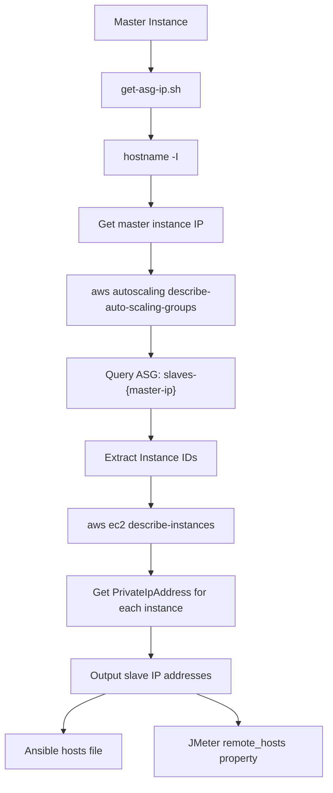
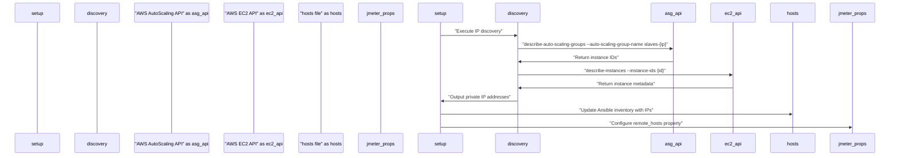
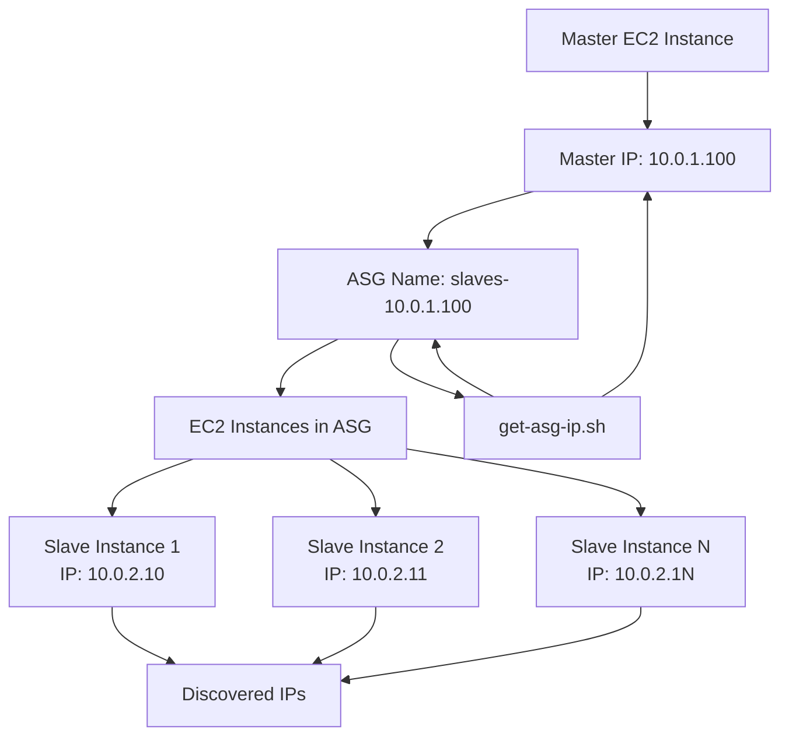

# Instance Discovery

Relevant source files

The following files were used as context for generating this wiki page:

- [get-asg-ip.sh](get-asg-ip.sh)

This document covers the instance discovery mechanism used to identify and retrieve the IP addresses of provisioned JMeter slave instances within AWS Auto Scaling Groups. Instance discovery is a critical component that enables the master instance to establish communication with dynamically provisioned slave nodes for distributed load testing.

For information about the Auto Scaling Group provisioning process, see [Auto Scaling Group Management](#4.1). For details on how discovered instances are configured through Ansible, see [Inventory Management](#5.2).

## Purpose and Overview

Instance discovery serves as the bridge between AWS infrastructure provisioning and JMeter configuration. After the Auto Scaling Group provisions slave instances, the system must programmatically discover their private IP addresses to:

- Update the Ansible inventory file with current slave endpoints
- Configure JMeter's `remote_hosts` property for distributed execution
- Enable proper master-slave communication during test execution

The discovery process operates by querying AWS APIs to retrieve instance metadata from the Auto Scaling Group associated with the current master instance.

## Discovery Implementation

The core instance discovery logic is implemented in the `get-asg-ip.sh` script, which performs AWS API queries to extract private IP addresses from Auto Scaling Group instances.

**IP Address Discovery Flow**

Sources: [get-asg-ip.sh:1-8]()

### Core Discovery Script

The `get-asg-ip.sh` script implements a two-stage AWS API query process:

**Stage 1: Auto Scaling Group Query**
[get-asg-ip.sh:3-5]() performs the initial discovery by:
- Retrieving the master instance's IP address using `hostname -I`
- Constructing the ASG name as `slaves-{master-ip}`
- Querying `aws autoscaling describe-auto-scaling-groups` to get instance IDs

**Stage 2: Instance IP Resolution**
[get-asg-ip.sh:6-8]() resolves private IP addresses by:
- Iterating through each discovered instance ID
- Calling `aws ec2 describe-instances` for detailed instance metadata
- Extracting the `PrivateIpAddress` field from the response

Sources: [get-asg-ip.sh:1-8]()

## Integration with System Components

The instance discovery mechanism integrates with multiple system components to enable distributed test execution:

**Component Integration Flow**

Sources: [get-asg-ip.sh:1-8]()

### Auto Scaling Group Naming Convention

The discovery mechanism relies on a specific ASG naming convention where slave instances are grouped under an Auto Scaling Group named `slaves-{master-ip}`. This naming pattern enables the master instance to:

- Identify its associated slave instances programmatically
- Isolate slave discovery to its own provisioned resources
- Support multiple concurrent master instances without conflicts

**AWS Resource Hierarchy**

Sources: [get-asg-ip.sh:3-5]()

## Error Handling and Considerations

The instance discovery process assumes:

- AWS CLI is properly configured with necessary IAM permissions
- The Auto Scaling Group exists and contains running instances
- Instance metadata is accessible through AWS APIs
- Network connectivity allows AWS API calls from the master instance

The script outputs private IP addresses directly without additional validation, making it suitable for integration with shell-based orchestration scripts that handle error conditions at a higher level.

Sources: [get-asg-ip.sh:1-8]()
