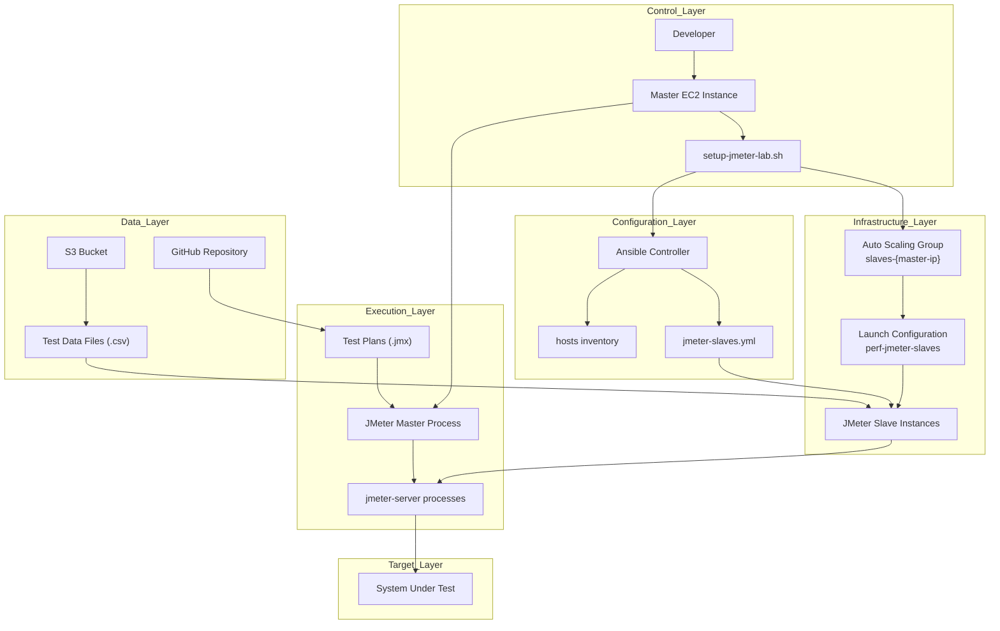
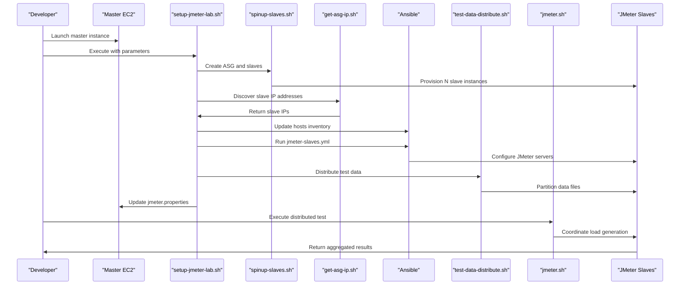
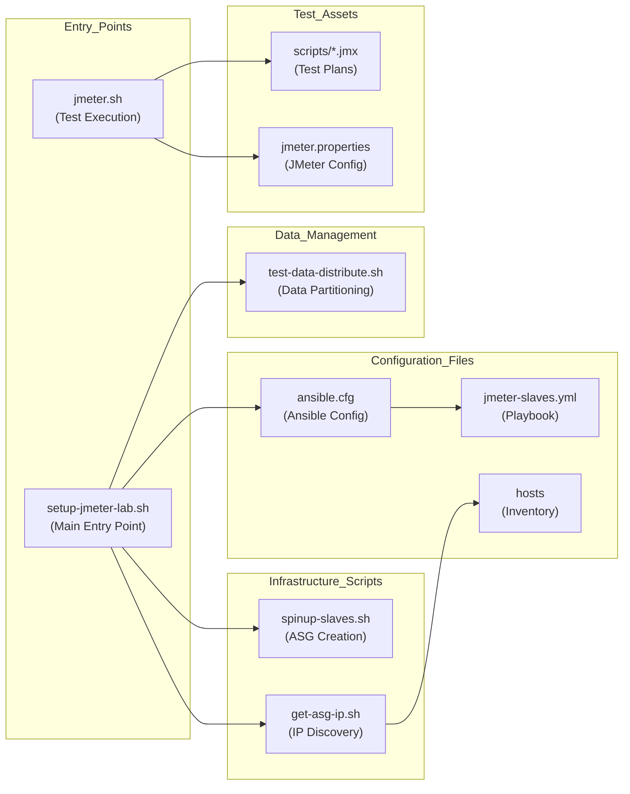

# Overview

Relevant source files

The following files were used as context for generating this wiki page:

- [README.md](README.md)

## Purpose and Scope

This document provides an overview of the automated distributed load testing system, which automates the setup and execution of JMeter-based distributed load tests on AWS infrastructure. The system orchestrates the provisioning of EC2 instances, configuration management, test data distribution, and load test execution across multiple JMeter slave nodes.

For detailed setup instructions, see [Quick Start Guide](#2). For in-depth architectural details, see [System Architecture](#3). For infrastructure management specifics, see [Infrastructure Management](#4).

## System Purpose

The automated distributed load testing system eliminates the manual overhead of setting up distributed JMeter environments by providing a fully automated solution that:

- **Provisions AWS Infrastructure**: Automatically creates Auto Scaling Groups and EC2 instances for JMeter slaves
- **Manages Configuration**: Uses Ansible to configure JMeter slave instances with necessary dependencies and configurations
- **Distributes Test Data**: Partitions large test data files across slave instances to prevent data duplication during load testing
- **Orchestrates Test Execution**: Coordinates distributed JMeter test execution from a master instance to multiple slave instances
- **Handles Cleanup**: Provides mechanisms to clean up provisioned resources after testing

## High-Level System Architecture

The system follows a master-slave architecture where a single master EC2 instance orchestrates multiple slave instances to generate distributed load against target systems.

**Sources:** [README.md:1-47]()

## Key Components

The system consists of several interconnected components that work together to provide automated distributed load testing capabilities:

| Component | Purpose | Key Files |
|-----------|---------|-----------|
| **Main Orchestrator** | Primary automation script that coordinates all system components | `setup-jmeter-lab.sh` |
| **Infrastructure Management** | AWS resource provisioning and management | `spinup-slaves.sh`, `get-asg-ip.sh` |
| **Configuration Management** | Ansible-based slave configuration and setup | `jmeter-slaves.yml`, `ansible.cfg` |
| **Data Distribution** | Test data partitioning and distribution to slaves | `test-data-distribute.sh` |
| **Test Execution** | JMeter master-slave coordination and test running | `jmeter.sh`, test plans (`.jmx` files) |

## Workflow Overview

The system implements a sequential workflow that progresses from infrastructure provisioning through test execution:

**Sources:** [README.md:25-46]()

## Code Structure Mapping

The system's functionality is distributed across several shell scripts and configuration files that map to specific operational phases:

**Sources:** [README.md:35-46]()

The system requires specific prerequisites including AWS IAM permissions, a pre-configured AMI with dependencies, and an S3 bucket for test data storage. The main workflow begins with executing `setup-jmeter-lab.sh` with parameters specifying the number of slaves, Git credentials, and S3 data folder, followed by test execution using `jmeter.sh` with the appropriate test plan.

**Sources:** [README.md:4-21](), [README.md:35-46]()
