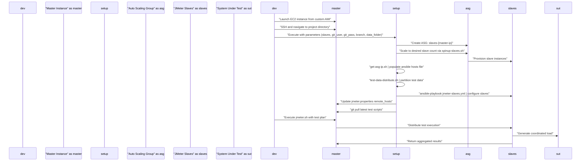

# Quick Start Guide

<details>
<summary>Relevant source files</summary>

The following files were used as context for generating this wiki page:

- [README.md](README.md)
- [setup-jmeter-lab.sh](setup-jmeter-lab.sh)

</details>


This document provides step-by-step instructions for setting up and running a distributed JMeter load test using the automated distributed load testing system. It covers the essential prerequisites, environment setup, and test execution workflow needed to get your first distributed load test running.

For detailed system architecture information, see [System Architecture](#3). For comprehensive configuration management details, see [Configuration Management](#5).

## Prerequisites

Before running distributed load tests, ensure you have the following AWS and system prerequisites configured:

| Component | Requirement | Purpose |
|-----------|-------------|---------|
| AWS IAM Permissions | EC2, S3, Auto Scaling | Create/destroy instances and access S3 buckets |
| Custom AMI | Pre-configured with dependencies | Base image for master and slave instances |
| Launch Configuration | Named `perf-jmeter-slaves` | Template for slave instance provisioning |
| S3 Bucket | With test data subfolders | Storage for large test data files |
| PEM Key File | Placed in `/opt/` directory | SSH access to provisioned instances |

### Required Software Dependencies

Install the following dependencies on your master instance:

```bash
sudo apt-get install python3-pip
pip3 install boto3
sudo apt-get install ansible
```

### Repository Structure Setup

The system expects the following directory structure in `/home/ubuntu/`:

```
automated-distributed-load-test/
├── jmeter/
│   └── apache-jmeter/
│       └── scripts/          # JMX test plan files
├── ansible-jmeter-slaves/    # Ansible configuration
└── setup-jmeter-lab.sh      # Main orchestration script
```

**Sources:** [README.md:4-22]()

## Environment Setup Workflow

The following diagram shows the high-level setup and execution workflow:

### Setup and Execution Flow



**Sources:** [setup-jmeter-lab.sh:1-43](), [README.md:25-46]()

## Running a Distributed Load Test

### Step 1: Launch Master Instance

Create a master EC2 instance using your pre-configured AMI:

```bash
aws ec2 run-instances \
  --image-id <your-ami-id> \
  --count 1 \
  --instance-type <instance-type> \
  --key-name <your-key-name> \
  --security-group-ids <security-group-id> \
  --subnet-id <subnet-id>
```

### Step 2: Prepare Test Assets

1. **Test Plan**: Commit your JMX file to the `jmeter/apache-jmeter/scripts/` directory
2. **Test Data**: Upload test data files to your S3 bucket subfolder corresponding to your test scenario

### Step 3: Execute Environment Setup

SSH into the master instance and run the main orchestration script:

```bash
sh setup-jmeter-lab.sh <num_slaves> <github_username> <github_password> <git_branch> <s3_data_folder>
```

#### Parameter Details

| Parameter | Description | Example |
|-----------|-------------|---------|
| `num_slaves` | Number of JMeter slave instances to provision | `10` |
| `github_username` | GitHub username for repository access | `myuser` |
| `github_password` | GitHub password or token | `mytoken` |
| `git_branch` | Branch containing test scripts | `main` |
| `s3_data_folder` | S3 subfolder containing test data | `load-test-scenario-1` |

### Step 4: Execute Load Test

Navigate to the JMeter binary directory and execute your test plan:

```bash
cd /home/ubuntu/automated-distributed-load-test/jmeter/apache-jmeter-5.4.2/bin
nohup sh jmeter.sh -n -t ../../scripts/<test-plan>.jmx -r -l /home/ubuntu/results/<results>.jtl &
```

#### JMeter Command Parameters

| Parameter | Description |
|-----------|-------------|
| `-n` | Non-GUI mode |
| `-t` | Test plan file path |
| `-r` | Run remote (distributed) test |
| `-l` | Results log file path |

**Sources:** [README.md:35-46]()

## Key Script Functions and Flow

The following diagram maps the main workflow to specific script functions:

### Script Execution Mapping

```mermaid
flowchart TD
    setup["setup-jmeter-lab.sh"] --> asg_create["aws autoscaling create-auto-scaling-group"]
    setup --> ssh_agent["eval ssh-agent -s && ssh-add"]
    setup --> spinup["spinup-slaves.sh"]
    setup --> sleep["sleep 30s"]
    setup --> get_ips["get-asg-ip.sh"]
    get_ips --> hosts["ansible-jmeter-slaves/hosts"]
    setup --> distribute["test-data-distribute.sh"]
    setup --> ansible["ansible-playbook jmeter-slaves.yml"]
    setup --> jmeter_props["sed jmeter.properties remote_hosts"]
    setup --> git_pull["git pull"]
    
    spinup --> asg_scale["Auto Scaling Group scaling"]
    get_ips --> ip_extraction["awk -F '\"' '{print $2}'"]
    distribute --> data_split["Split test data by slave count"]
    ansible --> repo_clone["Clone repository on slaves"]
    ansible --> jmeter_server["Start jmeter-server processes"]
    
    style setup fill:#ff9800
    style spinup fill:#4caf50
    style get_ips fill:#4caf50
    style distribute fill:#9c27b0
    style ansible fill:#2196f3
```

**Sources:** [setup-jmeter-lab.sh:6-43]()

## Expected Output and Verification

### Successful Setup Indicators

1. **ASG Creation**: Console output shows "Creating ASG : slaves-{master-ip}"
2. **Ansible Execution**: Message "Running ansible script to pull latest repo on slave machines"
3. **IP Configuration**: Message "Copying new servers IP into jmeter.properties"
4. **Remote Hosts Update**: Updated `remote_hosts` property in [jmeter/apache-jmeter-5.4.2/bin/jmeter.properties]()

### Test Execution Verification

- **Process Status**: `nohup` process running in background
- **Results File**: JTL file generation in `/home/ubuntu/results/`
- **Slave Connectivity**: JMeter master can connect to all configured slaves
- **Load Distribution**: Coordinated load generation across all slave instances

**Sources:** [setup-jmeter-lab.sh:6-40](), [README.md:42-46]()
