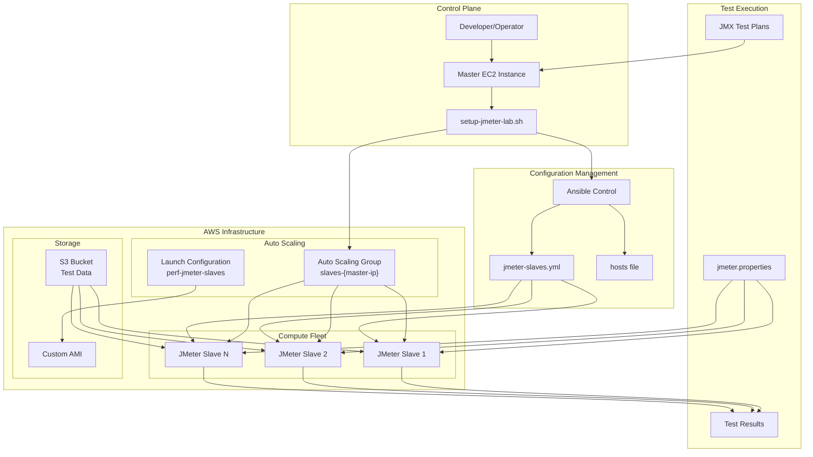
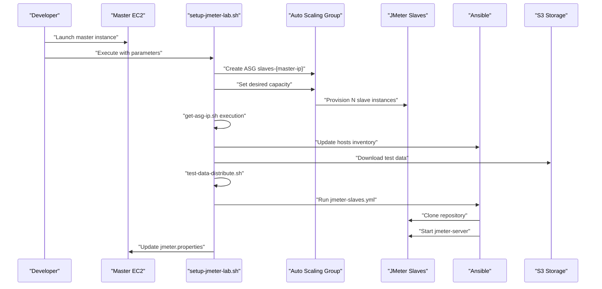
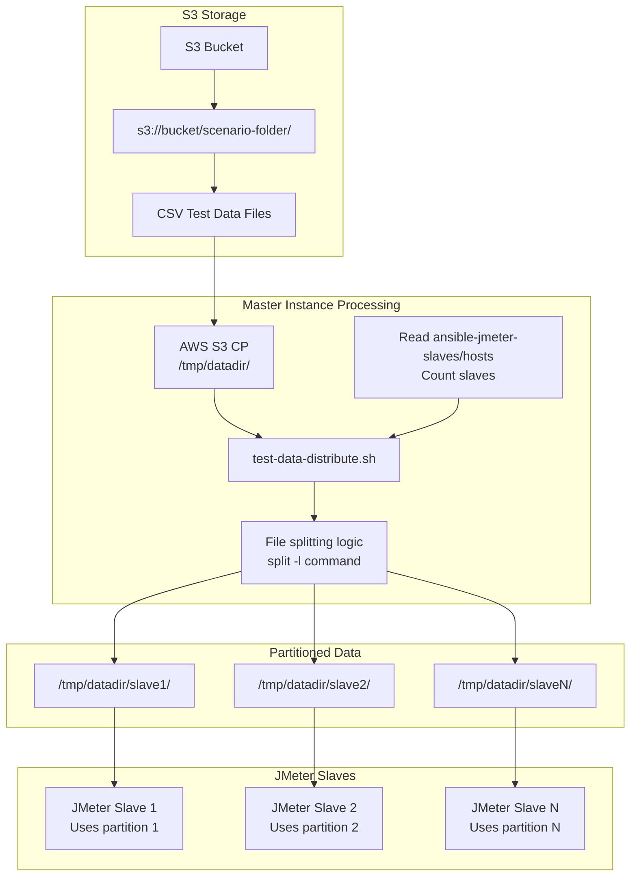
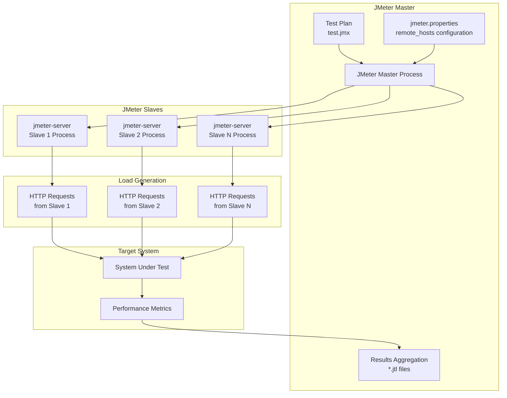
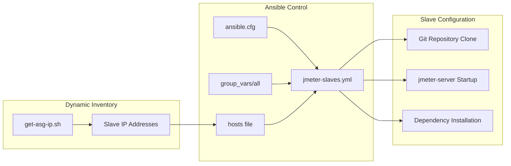

# System Architecture

<details>
<summary>Relevant source files</summary>

The following files were used as context for generating this wiki page:

- [README.md](README.md)
- [setup-jmeter-lab.sh](setup-jmeter-lab.sh)
- [test-data-distribute.sh](test-data-distribute.sh)

</details>


This document explains the overall system design, component relationships, and data flow through the automated distributed JMeter load testing pipeline. The system uses AWS infrastructure with Auto Scaling Groups to provision JMeter slave instances and Ansible for configuration management.

For detailed infrastructure provisioning steps, see [Infrastructure Management](#4). For configuration management specifics, see [Configuration Management](#5). For test execution workflows, see [Test Execution](#7).

## Architecture Overview

The system implements a distributed JMeter testing architecture with a master-slave pattern. A single master EC2 instance orchestrates multiple slave instances that are provisioned through AWS Auto Scaling Groups. The master coordinates test execution while slaves generate the actual load against the target system.

### High-Level System Components



**Sources:** [README.md:1-47](), [setup-jmeter-lab.sh:1-43]()

## Component Architecture

The system consists of several interconnected components that handle different aspects of the distributed testing pipeline:

| Component Type | Key Files/Scripts | Purpose |
|----------------|------------------|---------|
| **Main Orchestrator** | `setup-jmeter-lab.sh` | Coordinates entire setup process |
| **Infrastructure Management** | `spinup-slaves.sh`, `get-asg-ip.sh` | Manages AWS resources and instance discovery |
| **Data Distribution** | `test-data-distribute.sh` | Partitions test data across slaves |
| **Configuration Management** | `ansible-jmeter-slaves/jmeter-slaves.yml` | Configures JMeter slaves via Ansible |
| **Test Execution** | `jmeter.sh`, `.jmx` files | Executes distributed load tests |

### Infrastructure Provisioning Flow



**Sources:** [setup-jmeter-lab.sh:6-43](), [README.md:35-46]()

## Data Flow Architecture

### Test Data Distribution System

The system implements a sophisticated data partitioning mechanism to prevent duplicate data usage across slave instances:



**Sources:** [test-data-distribute.sh:1-27](), [setup-jmeter-lab.sh:29]()

### Data Partitioning Algorithm

The data distribution follows this algorithm implemented in `test-data-distribute.sh`:

1. **Download Phase**: Download all CSV files from S3 to `/tmp/datadir/` [test-data-distribute.sh:7]()
2. **Inventory Reading**: Count slave instances from `ansible-jmeter-slaves/hosts` [test-data-distribute.sh:10-11]()
3. **Directory Creation**: Create subdirectories for each slave [test-data-distribute.sh:10]()
4. **File Processing**: For each CSV file:
   - Calculate lines per partition: `divfilelen=$(($filelen/$len))` [test-data-distribute.sh:18]()
   - Split file using: `split -l $divfilelen $f datafilesdistrib_` [test-data-distribute.sh:19]()
   - Distribute partitions to slave directories [test-data-distribute.sh:22]()

## JMeter Master-Slave Architecture

### JMeter Coordination System



**Sources:** [setup-jmeter-lab.sh:40](), [README.md:42-46]()

### Remote Hosts Configuration

The master coordinates with slaves through the `remote_hosts` property in `jmeter.properties`. The `setup-jmeter-lab.sh` script dynamically updates this configuration:

```bash
OUT=$(sh $dir/get-asg-ip.sh | awk -F '"' '{print $2}' | awk '{ printf("%s,", $0) }' | rev | cut -c2- | rev)
sed -i "s/remote_hosts=.*/remote_hosts=$OUT/g" $dir/jmeter/apache-jmeter-5.4.2/bin/jmeter.properties
```

This creates a comma-separated list of slave IP addresses that JMeter uses for distributed execution.

**Sources:** [setup-jmeter-lab.sh:36-40]()

## Configuration Management Architecture

### Ansible Integration

The system uses Ansible for automated configuration of slave instances:



**Sources:** [setup-jmeter-lab.sh:26](), [setup-jmeter-lab.sh:32]()

The Ansible playbook execution includes Git credentials and branch specification:
```bash
ansible-playbook jmeter-slaves.yml -u ubuntu -e "git_user=$2" -e "git_pass=$3" -e "git_branch=$4"
```

## System Integration Points

### Key Integration Interfaces

| Interface | Source Component | Target Component | Protocol/Method |
|-----------|------------------|------------------|-----------------|
| **AWS API** | `setup-jmeter-lab.sh` | Auto Scaling Groups | AWS CLI commands |
| **SSH** | Ansible | JMeter Slaves | SSH with key authentication |
| **JMeter RMI** | JMeter Master | JMeter Slaves | RMI protocol on default ports |
| **Git HTTPS** | All instances | GitHub Repository | HTTPS with credentials |
| **S3 API** | Master instance | S3 Storage | AWS S3 CLI commands |

### Error Handling and Resilience

The system includes several resilience mechanisms:

- **SSH Agent Management**: Ensures SSH connectivity for Ansible [setup-jmeter-lab.sh:13-16]()
- **Wait Intervals**: Built-in delays for resource provisioning [setup-jmeter-lab.sh:21]()
- **Data Cleanup**: Automatic cleanup of temporary data files [test-data-distribute.sh:6]()

**Sources:** [setup-jmeter-lab.sh:1-43](), [test-data-distribute.sh:1-27]()
