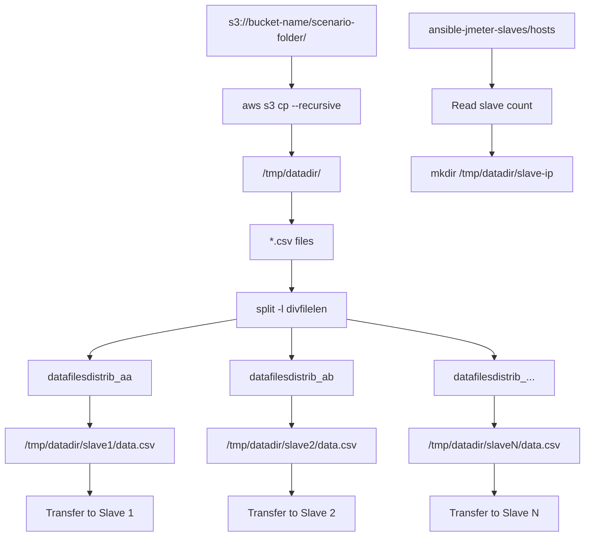
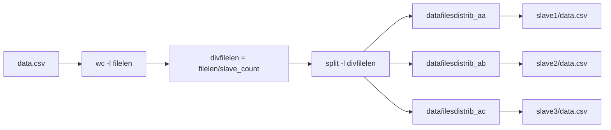
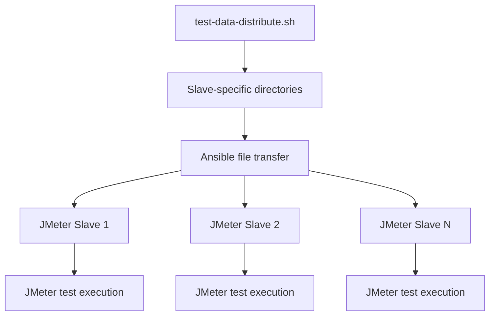

# Test Data Management

<details>
<summary>Relevant source files</summary>

The following files were used as context for generating this wiki page:

- [test-data-distribute.sh](test-data-distribute.sh)

</details>


This document explains how test data is managed and distributed across JMeter slave instances in the automated distributed load testing system. The primary focus is on preventing data duplication and ensuring each slave instance receives a unique partition of test data for realistic load generation.

For information about the overall system architecture and how test data management fits into the broader infrastructure, see [System Architecture](#3). For details about JMeter test execution that consumes this distributed data, see [Test Execution](#7).

## Purpose and Data Distribution Strategy

The test data management system solves a critical problem in distributed load testing: ensuring that multiple JMeter slaves don't use identical test data, which would create unrealistic load patterns. Instead of each slave using the complete dataset, the system partitions test data files and distributes unique subsets to each slave instance.

The core responsibilities include:
- Downloading test data from S3 storage
- Dynamically partitioning data based on the number of active slaves
- Distributing unique data partitions to each slave instance
- Maintaining consistent file naming conventions across slaves



**Data Partitioning Flow**

Sources: [test-data-distribute.sh:1-27]()

## Source Data Management

Test data originates from S3 storage and is organized by test scenario. The system expects data to be stored in a structured S3 bucket with scenario-specific folders containing CSV files.

### S3 Data Retrieval

The distribution process begins by downloading all test data files from a specified S3 location to the master instance's temporary directory:

```bash
aws s3 cp s3://<bucket-name>/$1/ ./ --recursive
```

Key characteristics:
- Data is downloaded to `/tmp/datadir/` on the master instance
- The `$1` parameter represents the scenario folder name passed to the script
- All files in the scenario folder are downloaded recursively
- Previous data is cleaned up before new downloads begin

The system creates and cleans the working directory using: [test-data-distribute.sh:5-7]()

Sources: [test-data-distribute.sh:5-7]()

## Data Partitioning Process

Once test data is available locally, the system dynamically partitions it based on the current number of active slave instances. This ensures optimal data distribution regardless of the slave count.

### Slave Instance Discovery

The partitioning process reads the Ansible inventory to determine how many slaves are active:

| Operation | Implementation | Purpose |
|-----------|---------------|---------|
| Read hosts file | `cat $dir/ansible-jmeter-slaves/hosts` | Get list of slave IP addresses |
| Count slaves | `wc -l` | Determine partition count |
| Create directories | `mkdir /tmp/datadir/$p` | Prepare slave-specific folders |

The system creates a separate directory for each slave instance identified in the hosts file: [test-data-distribute.sh:10-11]()

### CSV File Splitting

For each CSV file in the downloaded data, the system calculates partition sizes and splits the data:



**CSV Splitting and Distribution Process**

The splitting algorithm:
1. Counts total lines in each CSV file
2. Calculates lines per partition: `divfilelen=$(($filelen/$len))`
3. Uses Unix `split` command with line-based partitioning
4. Generates temporary files with sequential suffixes (`datafilesdistrib_aa`, `datafilesdistrib_ab`, etc.)

Sources: [test-data-distribute.sh:13-23]()

## Distribution to Slave Instances

After partitioning, the system distributes unique data sets to each slave's designated directory while preserving original file names.

### File Distribution Logic

The distribution process maps partitioned files to slave directories:

```bash
filearr=($(ls -l datafilesdistrib_* | awk -F" " '{print $9}' | head -n $len))
folderarr=($(ls -p | grep /))
for i in "${!folderarr[@]}"; do mv ${filearr[i]} ${folderarr[i]}/$f ; done
```

Key aspects:
- Creates arrays of partition files and slave directories
- Maps partitions to slaves using array indexing
- Renames partitioned files back to original CSV names
- Ensures each slave receives exactly one unique partition per CSV file

The final directory structure on the master instance:
```
/tmp/datadir/
├── slave-ip-1/
│   ├── data1.csv (partition 1)
│   └── data2.csv (partition 1)
├── slave-ip-2/
│   ├── data1.csv (partition 2)
│   └── data2.csv (partition 2)
└── slave-ip-n/
    ├── data1.csv (partition n)
    └── data2.csv (partition n)
```

Sources: [test-data-distribute.sh:20-22]()

## Cleanup and Transfer Operations

The system performs cleanup operations to remove temporary files and prepare for data transfer to slave instances.

### Temporary File Cleanup

After successful distribution, the system removes intermediate partition files:
```bash
rm datafilesdistrib_*
```

This cleanup ensures:
- No temporary partition files remain on the master
- Only the properly distributed slave directories contain data
- Disk space is efficiently managed

### Integration with Ansible Distribution

While the `test-data-distribute.sh` script handles local partitioning, the actual transfer to slave instances is coordinated through the broader infrastructure management system. The partitioned data in slave-specific directories is subsequently transferred to the corresponding JMeter slave instances through Ansible automation.



**Integration with Distributed Testing Pipeline**

Sources: [test-data-distribute.sh:25-26]()
