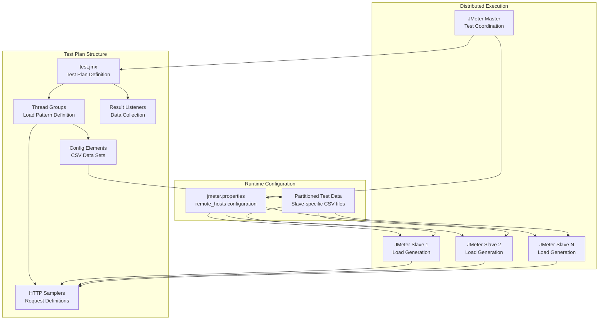
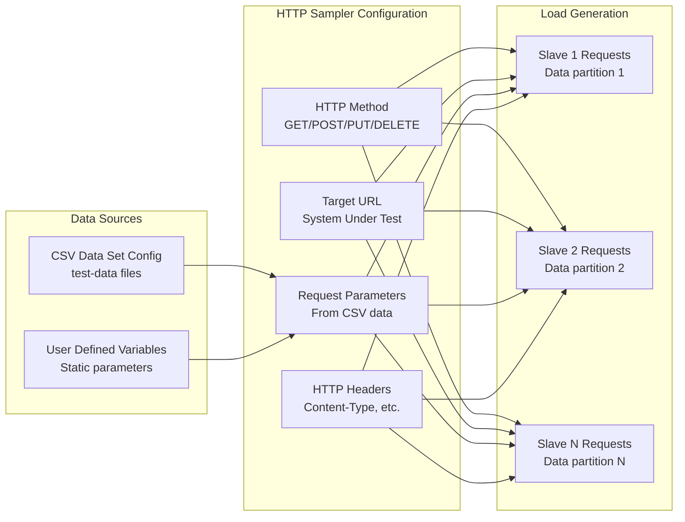
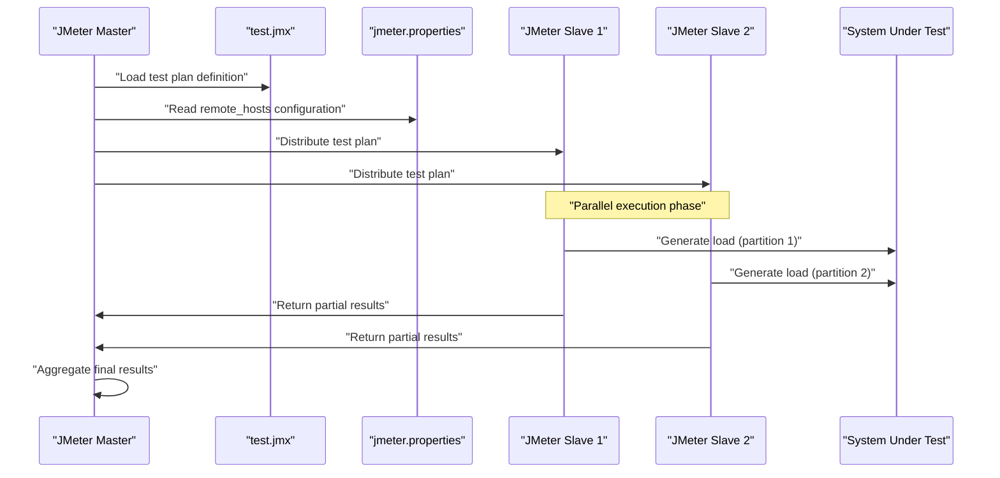

# JMeter Test Plans

Relevant source files

The following files were used as context for generating this wiki page:

- [jmeter/scripts/test.jmx](jmeter/scripts/test.jmx)

## Purpose and Scope

This document explains the structure and components of JMeter test plans (`.jmx` files) used in the automated distributed load testing environment. It covers how test plans are designed to work with the distributed master-slave architecture and the specific configuration requirements for coordinated load testing across multiple JMeter slave instances.

For information about executing distributed tests using these test plans, see [Running Distributed Tests](#7.2). For details about test data preparation and distribution, see [Test Data Management](#6).

## Test Plan Architecture in Distributed Context

JMeter test plans in this system are designed to work within a distributed architecture where a single master instance coordinates test execution across multiple slave instances. The test plans must be structured to support this distributed execution model.

**Sources:** [jmeter/scripts/test.jmx:1-1]()

## Core Test Plan Components

### Thread Group Configuration

Thread groups in distributed test plans define the load pattern that will be executed across all slave instances. The total load is distributed among the slaves, with each slave executing its portion of the configured thread count.

| Component | Purpose | Distributed Considerations |
|-----------|---------|---------------------------|
| Thread Count | Number of concurrent users | Total divided across slaves |
| Ramp-up Period | Time to reach full load | Synchronized across slaves |
| Loop Count | Test iterations | Each slave executes full count |
| Scheduler | Test duration control | Coordinated timing across slaves |

### HTTP Request Samplers

HTTP samplers define the actual requests that generate load against the target system. In the distributed environment, each slave executes these samplers independently using its portion of the test data.

**Sources:** [jmeter/scripts/test.jmx:1-1]()

### CSV Data Set Configuration

CSV Data Set Config elements are crucial in distributed testing to ensure each slave uses unique test data. The test data distribution system partitions CSV files so each slave accesses its own subset.

| Property | Configuration | Distributed Behavior |
|----------|---------------|---------------------|
| Filename | `/tmp/datadir/*.csv` | Points to slave-specific partition |
| Variable Names | Column mappings | Consistent across all slaves |
| Delimiter | CSV separator | Standardized format |
| Recycle on EOF | Data reuse behavior | Independent per slave |
| Stop thread on EOF | Completion handling | Coordinated termination |

## Integration with Master-Slave Architecture

### Remote Execution Coordination

The master instance uses the `jmeter.properties` file to coordinate test execution across slaves. The test plan itself remains unchanged, but its execution is distributed through JMeter's remote testing capabilities.

**Sources:** [jmeter/scripts/test.jmx:1-1]()

### Result Collection and Aggregation

Result listeners in the test plan collect performance metrics from each slave. The master aggregates these results to provide a consolidated view of the distributed test execution.

## Configuration Requirements

### File Path Conventions

Test plans must use standardized file paths that align with the test data distribution system:

- CSV data files: `/tmp/datadir/*.csv` - Points to slave-specific partitioned data
- Result files: `/tmp/results/` - Local result collection directory
- Log files: `/tmp/logs/jmeter.log` - Slave-specific logging

### Property Dependencies

Test plans rely on several JMeter properties configured by the orchestration system:

| Property | Purpose | Set By |
|----------|---------|--------|
| `remote_hosts` | Slave IP addresses | `setup-jmeter-lab.sh` |
| `server.rmi.ssl.disable` | RMI configuration | Ansible playbook |
| `java.rmi.server.hostname` | Network binding | Instance metadata |

**Sources:** [jmeter/scripts/test.jmx:1-1]()
