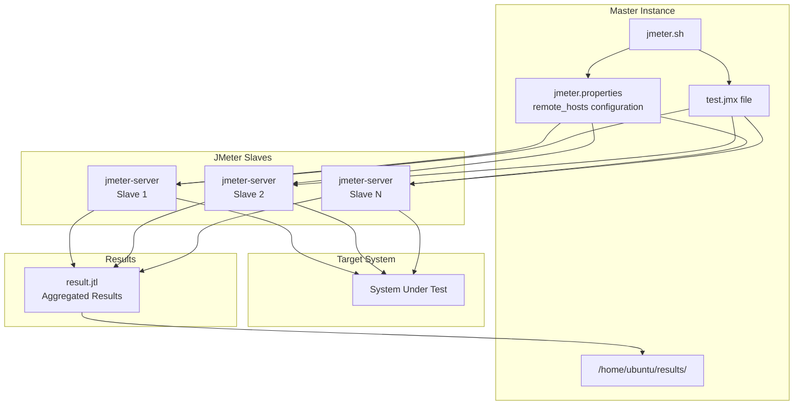
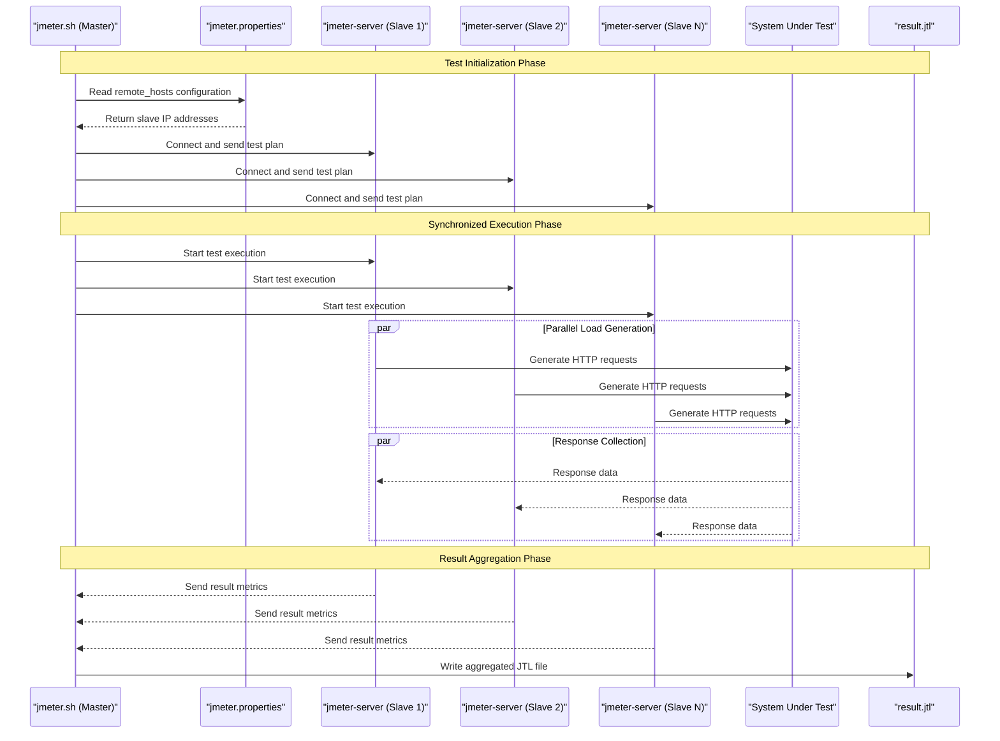

# Running Distributed Tests

<details>
<summary>Relevant source files</summary>

The following files were used as context for generating this wiki page:

- [README.md](README.md)

</details>


This page details the process of executing distributed JMeter tests after the infrastructure and configuration setup is complete. It covers the command-line execution, master-slave coordination, and result collection mechanisms.

For information about setting up the distributed testing environment, see [Quick Start Guide](#2). For details about JMeter test plan structure, see [JMeter Test Plans](#7.1).

## Test Execution Overview

After completing the infrastructure setup using `setup-jmeter-lab.sh`, the actual distributed test execution involves the JMeter master coordinating with multiple slave instances to generate load against the target system. The master distributes the test plan to all slaves and aggregates the results.

**Test Execution Architecture**



Sources: [README.md:42-46]()

## Command Line Execution

The distributed test execution is initiated from the JMeter master instance using the `jmeter.sh` script with specific command-line parameters for distributed mode.

### Basic Execution Command

The standard command for running a distributed JMeter test is executed from the `/home/ubuntu/automated-distributed-load-test/jmeter/apache-jmeter-5.4.2/bin` directory:

```bash
nohup sh jmeter.sh -n -t ../../scripts/<filename>.jmx -r -l /home/ubuntu/results/<result-filename>.jtl &
```

### Command Parameters

| Parameter | Purpose | Description |
|-----------|---------|-------------|
| `nohup` | Background execution | Prevents termination when SSH session ends |
| `jmeter.sh` | JMeter executable | Main JMeter execution script |
| `-n` | Non-GUI mode | Runs JMeter in command-line mode |
| `-t` | Test plan | Specifies the JMX test plan file |
| `-r` | Remote execution | Enables distributed testing mode |
| `-l` | Log file | Specifies the results output file |
| `&` | Background process | Runs the command in background |

### File Path Structure

The command assumes the following directory structure:
- Test plans: `../../scripts/<filename>.jmx` (relative to JMeter bin directory)
- Results: `/home/ubuntu/results/<result-filename>.jtl`
- Execution directory: `/home/ubuntu/automated-distributed-load-test/jmeter/apache-jmeter-5.4.2/bin`

Sources: [README.md:42-46]()

## Master-Slave Coordination Process

The JMeter master uses the `remote_hosts` property configured during setup to coordinate test execution across all slave instances. This process involves test plan distribution, synchronized execution, and result aggregation.

**Distributed Test Execution Flow**



### Remote Hosts Configuration

The master discovers slave instances through the `jmeter.properties` file, which is updated by the setup process with the `remote_hosts` property containing all slave IP addresses.

### Test Plan Distribution

When the `-r` flag is used, JMeter automatically:
1. Reads the `remote_hosts` property from `jmeter.properties`
2. Connects to each slave's `jmeter-server` process
3. Transmits the test plan (JMX file) to all slaves
4. Synchronizes the start of test execution

Sources: [README.md:42-46]()

## Result Collection and Aggregation

The JMeter master collects performance metrics from all slave instances and aggregates them into a single JTL (JMeter Test Log) file. This file contains comprehensive test results including response times, throughput, and error rates.

### Result File Format

The output JTL file specified by the `-l` parameter contains:
- Aggregated response times from all slaves
- Combined throughput metrics
- Error statistics across the distributed load
- Timestamp data for performance analysis

### Result File Location

Results are written to `/home/ubuntu/results/<result-filename>.jtl` as specified in the command line. This directory must exist or be created before test execution.

### Background Execution Monitoring

Since the test runs with `nohup` and `&`, the execution continues even if the SSH session is terminated. Monitor progress by:
- Checking the JTL file growth: `tail -f /home/ubuntu/results/<result-filename>.jtl`
- Monitoring JMeter processes: `ps aux | grep jmeter`
- Checking system resources: `top` or `htop`

Sources: [README.md:42-46]()

## Prerequisites for Test Execution

Before running distributed tests, ensure the following setup is complete:

1. **Infrastructure Setup**: Auto Scaling Group with slave instances provisioned
2. **Configuration Management**: Ansible playbook executed to configure slaves
3. **Test Data Distribution**: Data files distributed to slave instances if required
4. **JMeter Properties**: `remote_hosts` property updated with slave IP addresses
5. **Test Plan**: JMX file available in the `scripts` directory

The setup process using `setup-jmeter-lab.sh` handles all these prerequisites automatically.

Sources: [README.md:35-46]()
