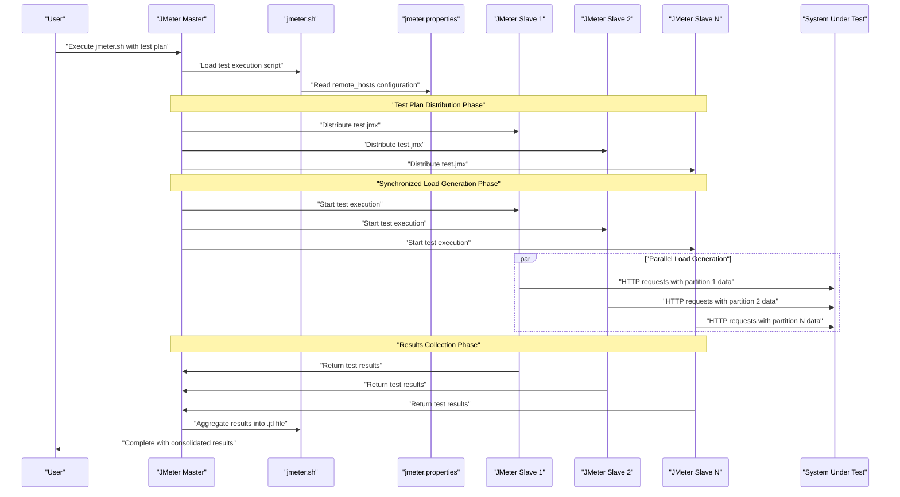
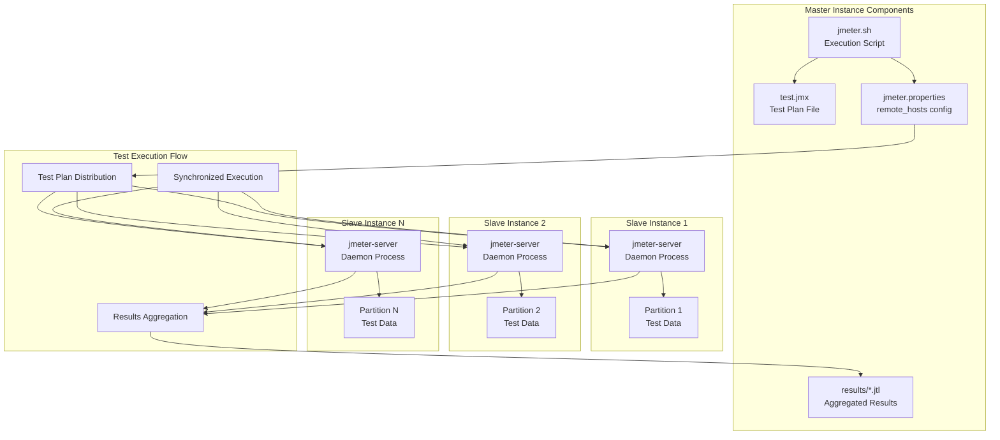
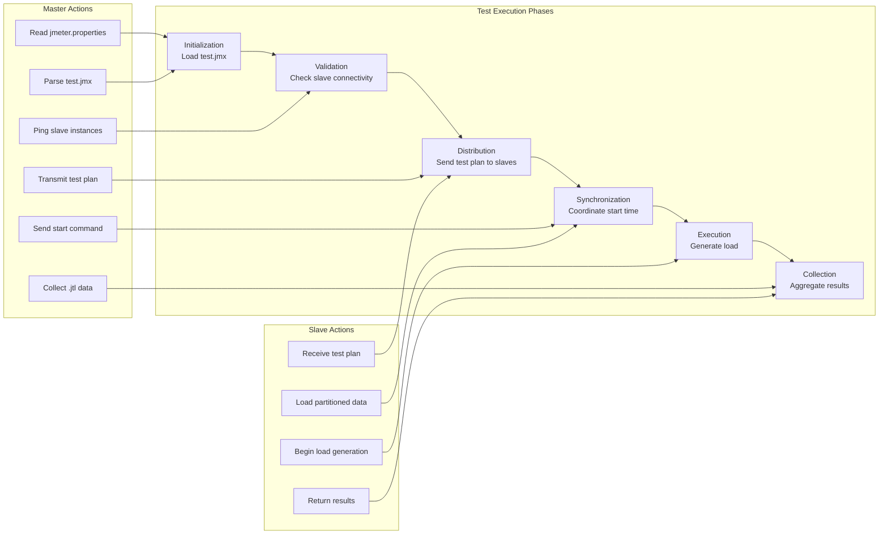

# Test Execution

<details>
<summary>Relevant source files</summary>

The following files were used as context for generating this wiki page:

- [README.md](README.md)
- [jmeter/scripts/test.jmx](jmeter/scripts/test.jmx)

</details>


This document covers the test execution phase of the automated distributed load testing system, including the workflow for running JMeter test plans across distributed slave instances and the coordination between master and slave nodes. For detailed information about JMeter test plan structure, see [JMeter Test Plans](#7.1). For specific execution procedures, see [Running Distributed Tests](#7.2).

## Overview

Test execution in this distributed load testing system involves a master JMeter instance coordinating test execution across multiple slave instances. The master instance distributes the test plan to all slaves, aggregates results, and manages the overall test lifecycle. Each slave instance executes its portion of the load generation independently while reporting back to the master.

The execution process occurs after infrastructure provisioning and configuration management have completed, typically initiated by running the `jmeter.sh` script on the master instance with appropriate parameters.

## Test Execution Workflow

The distributed test execution follows a coordinated workflow between the master and slave instances:



Sources: [README.md:42-46]()

## Master-Slave Coordination Architecture

The JMeter master-slave coordination relies on specific configuration and communication protocols:



Sources: [README.md:42-46]()

## Test Plan Execution Process

Test execution begins after the infrastructure setup and configuration phases are complete. The process involves several key components working together:

### Execution Command Structure

The test execution is initiated using the `jmeter.sh` script with specific parameters that control the distributed test behavior:

| Parameter | Purpose | Example Value |
|-----------|---------|---------------|
| `-n` | Non-GUI mode execution | Required for automation |
| `-t` | Test plan file path | `../../scripts/test.jmx` |
| `-r` | Remote execution on all slaves | Enables distributed testing |
| `-l` | Results log file path | `/home/ubuntu/results/test-results.jtl` |

The complete execution command follows this pattern as shown in [README.md:45]():
```bash
nohup sh jmeter.sh -n -t ../../scripts/<filename>.jmx -r -l /home/ubuntu/results/<result-filename>.jtl &
```

### Configuration Requirements

Before test execution, the master instance must have properly configured:

1. **Remote Hosts Configuration**: The `jmeter.properties` file contains the `remote_hosts` property listing all slave IP addresses
2. **Test Plan Availability**: The `.jmx` test plan file must be present in the `scripts` directory
3. **Slave Readiness**: All `jmeter-server` processes must be running on slave instances
4. **Data Distribution**: Test data must be partitioned and distributed to slaves

### Execution Coordination

During execution, the master coordinates with slaves through the following sequence:



Sources: [README.md:42-46]()

## Results Collection and Aggregation

The master instance collects individual results from each slave and aggregates them into a single JTL (JMeter Test Log) file. This aggregated file contains:

- Response times from all slaves
- Throughput metrics across the distributed load
- Error rates and failure details
- Timestamp-synchronized data for accurate analysis

The results are stored in the `/home/ubuntu/results/` directory on the master instance, with filenames specified during execution.

Sources: [README.md:45](), [jmeter/scripts/test.jmx:1]()
